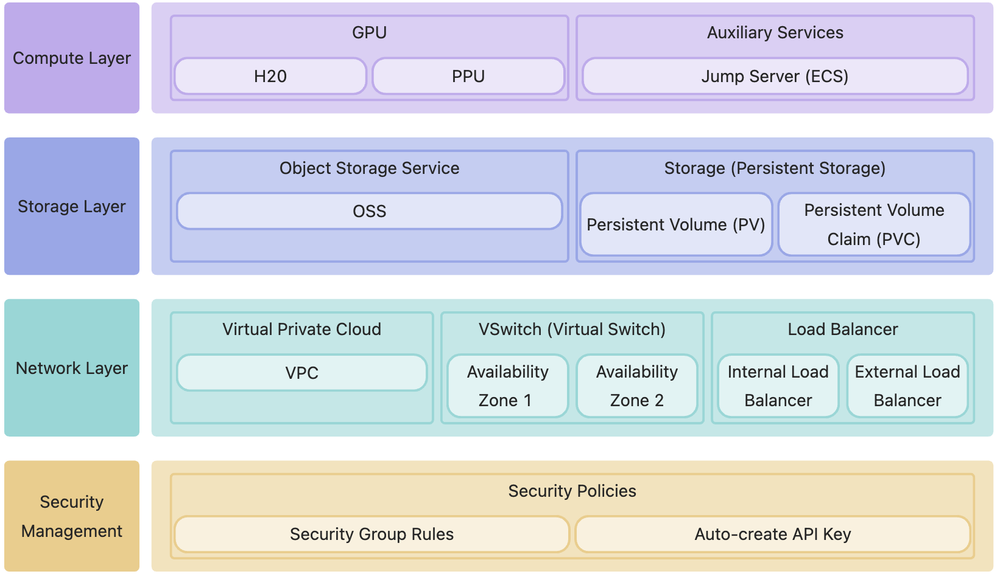
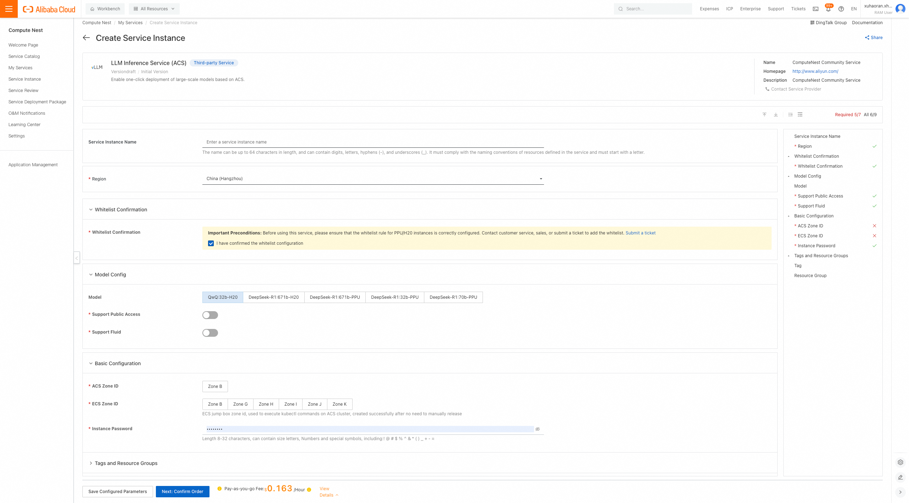
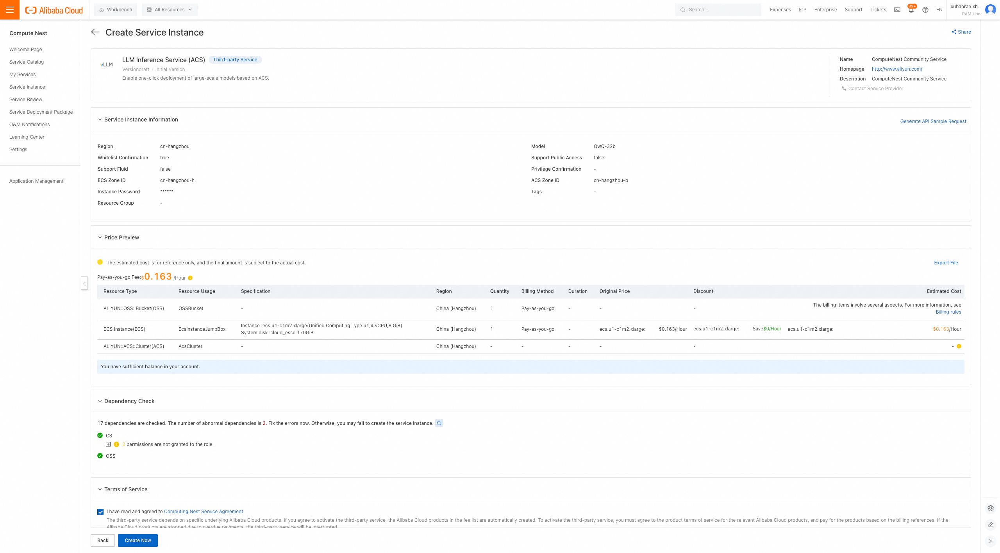
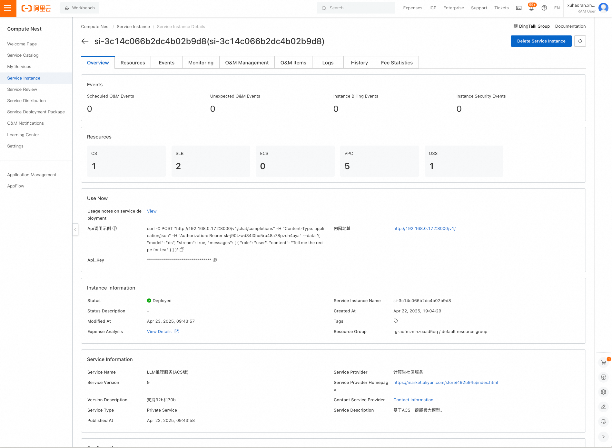
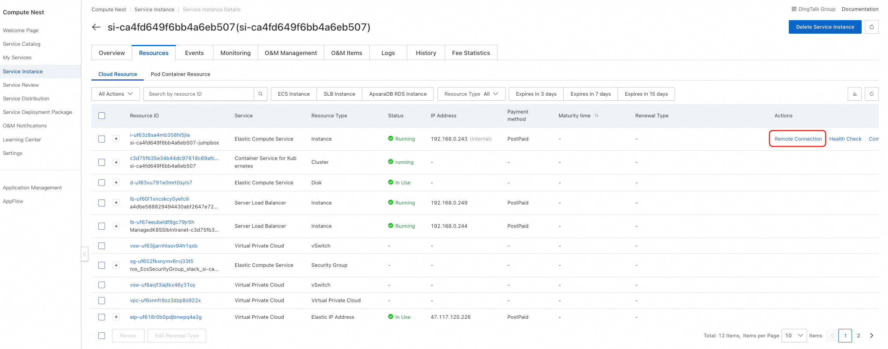
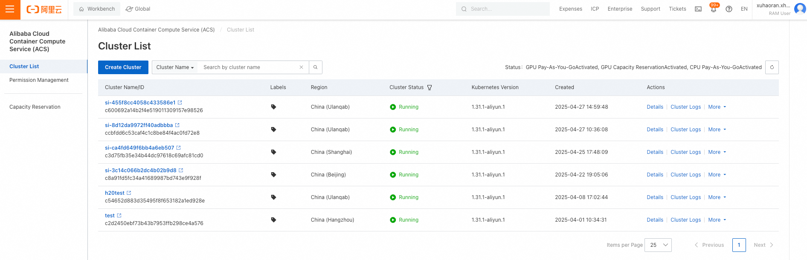
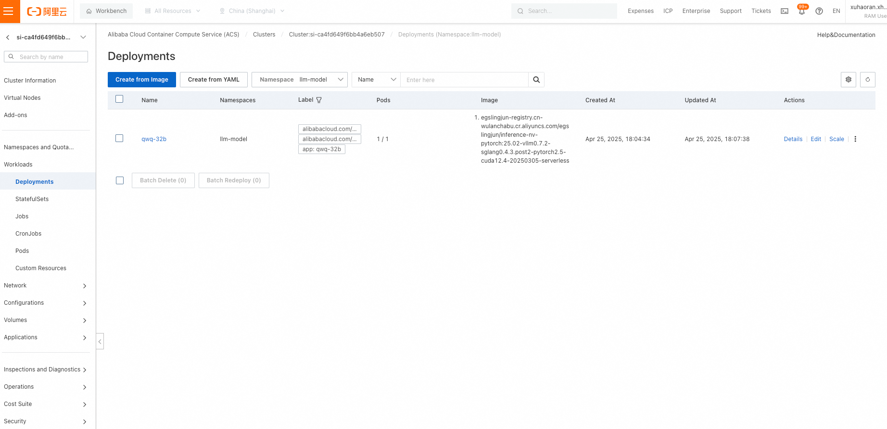
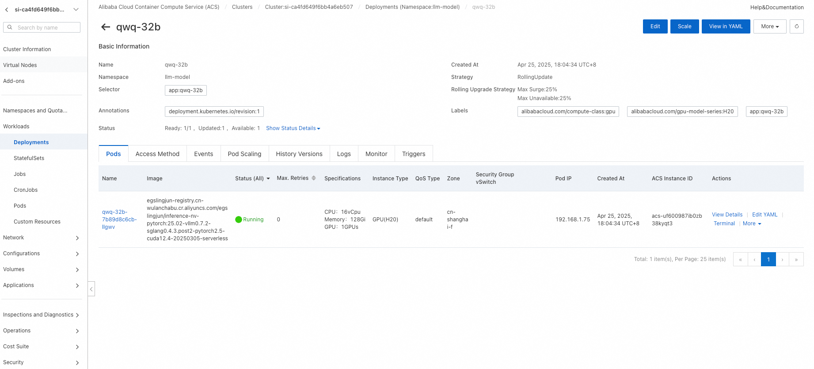

# vllm Large Model Deployment Guide on ACK Cluster

## Deployment Overview
This solution provides an out-of-the-box deployment of high-performance large model inference services using Alibaba Cloud ComputeNest. It is based on the following core components:

- **VLLM**: Provides high-performance parallel inference capabilities, supporting low-latency and high-throughput LLM inference (e.g., Qwen, DeepSeek, etc.).
- **ACK Cluster**: A managed Kubernetes environment supporting Serverless workloads.

After deployment, users can invoke model services via private/public APIs. Resource utilization is improved by several times, and developers need not manage underlying container orchestration or resource scheduling—only selecting the model on the ComputeNest console is required for one-click deployment.

The service supports various models and GPU types during deployment, including:
- **QwQ32B**
- **DeepSeek-R1-Distill-Qwen-32B**, GPU: PPU
- **DeepSeek-R1-Distill-Llama-70B**, GPU: PPU
- **Deepseek Full-Blooded Version (671B, fp8)**, GPU: H20
- **Deepseek Full-Blooded Version (671B, fp8)**, GPU: PPU

---

## Architecture Overview


---

## Cost Explanation
The costs for this service on Alibaba Cloud primarily include:
- **ACK Cluster Fees**
- **Jump Server (ECS) Fees**
  - Notes: This ECS instance is used to deploy and manage the K8s cluster. The `/root` directory contains the K8s YAML resource files used for deployment. Parameters can be modified and re-deployed directly afterward. The ECS can be released after deployment if no longer needed.
- **OSS Fees**
**Billing Method**: Pay-as-you-go (hourly) or subscription (prepaid). Estimated costs are visible in real-time during instance creation.

---

## Required RAM Account Permissions

The account deploying the instance requires permissions to access and manage Alibaba Cloud resources. The following policies must be included:

| Permission Policy Name                          | Notes                         |
|---------------------------------|----------------------------|
| AliyunECSFullAccess             | Permissions to manage ECS (Elastic Compute Service)       |
| AliyunVPCFullAccess             | Permissions to manage VPC (Virtual Private Cloud)         |
| AliyunROSFullAccess             | Permissions to manage ROS (Resource Orchestration Service) |
| AliyunCSFullAccess              | Permissions to manage ACK (Container Service)              |
| AliyunComputeNestUserFullAccess | Permissions to manage ComputeNest (user-side)              |
| AliyunOSSFullAccess             | Permissions to manage OSS (Object Storage Service)          |

**Important**: Contact PDSA to add GPU to your whitelist before deployment.

---

## Deployment Steps

1. Click the **[Deployment Link](https://computenest.console.aliyun.com/service/instance/create/cn-hangzhou?type=user&ServiceName=LLM%E6%8E%A8%E7%90%86%E6%9C%8D%E5%8A%A1(ACS%E7%89%88))**. Follow the interface prompts to fill in parameters and view cost estimates. Confirm parameters and click **Next: Confirm Order**.
   

2. Click **Next: Confirm Order** to preview costs. Then click **Deploy Now** and wait for completion.
   

3. After deployment, access the service. Navigate to the instance details to view private network access instructions. If "Support Public Network Access" was selected, public access instructions will also be available.
   

---

## Usage Guide

### Private Network API Access
1. Access the **Private API address** from an ECS instance within the same VPC. Example:
    ```shell
    # Private API request with authentication and streaming (remove "stream" to disable streaming)
    curl http://$PrivateIP:8000/v1/chat/completions \
      -H "Content-Type: application/json" \
      -H "Authorization: Bearer $API_KEY" \
      -d '{
        "model": "ds",
        "messages": [
          {
            "role": "user",
            "content": "Write a letter to your daughter from the future (2035), encouraging her to study science and technology to become a leader in this field. She is currently in 3rd grade."
          }
        ],
        "max_tokens": 1024,
        "temperature": 0,
        "top_p": 0.9,
        "seed": 10,
        "stream": true
      }'
    ```

### Public Network API Access
If "Support Public Network Access" was selected during deployment, use the public IP directly:
    ```shell
    curl http://$PublicIp:8000/v1/chat/completions \
      -H "Content-Type: application/json" \
      -d '{
        "model": "ds",
        "messages": [
          {
            "role": "user",
            "content": "Write a letter to your daughter from the future (2035), encouraging her to study science and technology to become a leader in this field. She is currently in 3rd grade."
          }
        ],
        "max_tokens": 1024,
        "temperature": 0,
        "top_p": 0.9,
        "seed": 10,
        "stream": true
      }'
    ```

If public access was not enabled, manually create a `LoadBalancer` in the cluster. Example (for DeepSeek-R1; adjust `labels.app` for QwQ-32B):
    ```yaml
    apiVersion: v1
    kind: Service
    metadata:
      annotations:
        service.beta.kubernetes.io/alibaba-cloud-loadbalancer-address-type: "internet"
        service.beta.kubernetes.io/alibaba-cloud-loadbalancer-ip-version: ipv4
      labels:
        app: deepseek-r1
      name: svc-public
      namespace: llm-model
    spec:
      externalTrafficPolicy: Local
      ports:
      - name: serving
        port: 8000
        protocol: TCP
        targetPort: 8000
      selector:
        app: deepseek-r1
      type: LoadBalancer
    ```

---

### Re-deploying Models
Models can be re-deployed using `kubectl apply` on the jump server or by manually updating templates in the console.

#### **Using the Jump Server**
1. In the ComputeNest console's instance resources page, locate the ECS jump server and connect via **Remote Connection** (password-free login).
   
2. Execute commands on the jump server:
    ```bash
    [root@iZ0jl6qbv1gs36mzvvl1gaZ ~]# cd /root
    [root@iZ0jl6qbv1gs36mzvvl1gaZ ~]# ls
    download.log  kubectl  llm-k8s-resource  llm-k8s-resource.tar.gz  llm-model  logtail.sh  ossutil-2.1.0-linux-amd64  ossutil-2.1.0-linux-amd64.zip
    [root@iZ0jl6qbv1gs36mzvvl1gaZ ~]# cd llm-k8s-resource/
    [root@iZ0jl6qbv1gs36mzvvl1gaZ llm-k8s-resource]# ll
    total 28
    -rw-r--r-- 1  502 games 2235 Apr 14 17:54 deepseek-h20-application.yaml
    -rw-r--r-- 1  502 games 3348 Apr 14 17:54 deepseek-ppu-application.yaml
    -rw-r--r-- 1 root root  2594 Apr 16 10:04 model.yaml
    -rw-r--r-- 1  502 games  930 Apr 16 10:04 pre-deploy-application.yaml
    -rw-r--r-- 1  502 games  426 Apr 16 10:21 private-service.yaml
    -rw-r--r-- 1  502 games  456 Apr 16 10:21 public-service.yaml
    -rw-r--r-- 1  502 games 2586 Apr 14 17:30 qwq-application.yaml

    # To deploy QwQ32B, execute:
    kubectl apply -f /root/llm-k8s-resource/qwq-application.yaml
    ```

#### **Using the Console**
1. Enter the ComputeNest console, click **Service Instances**, then **Resources** to find the ACK cluster. Enter its console.
   
2. In the ACK console, navigate to **Workloads** > **Stateful**. For example, view the QwQ-32B Deployment:
   
3. Click the Deployment to view details, then edit parameters or update YAML directly.
   

---

## Advanced Tutorials

### Customizing Fluid for Model Acceleration

**Fluid** is a Kubernetes-native engine for orchestrating and accelerating distributed datasets, optimizing performance for data-intensive applications like AI inference and large model training. To accelerate elastic scaling scenarios:
1. Deploy Fluid following the guide: [Fluid Documentation](https://help.aliyun.com/zh/cs/user-guide/using-acs-gpu-computing-power-to-build-a-distributed-deepseek-full-blood-version-reasoning-service).
2. Modify parameters such as `BucketName`, `ModelName`, and `JindoRuntime` settings in the YAML below:
    ```yaml
    apiVersion: data.fluid.io/v1alpha1
    kind: Dataset
    metadata:
      name: llm-model
      namespace: llm-model
    spec:
      placement: Shared
      mounts:
        - mountPoint: oss://${BucketName}/llm-model
          options:
            fs.oss.endpoint: oss-${RegionId}-internal.aliyuncs.com
          name: models
          path: "/"
          encryptOptions:
            - name: fs.oss.accessKeyId
              valueFrom:
                secretKeyRef:
                  name: oss-secret
                  key: akId
            - name: fs.oss.accessKeySecret
              valueFrom:
                secretKeyRef:
                  name: oss-secret
                  key: akSecret
    ---
    apiVersion: data.fluid.io/v1alpha1
    kind: JindoRuntime
    metadata:
      name: llm-model
      namespace: llm-model
    spec:
      networkmode: ContainerNetwork
      replicas: ${JindoRuntimeReplicas} # set replicas according to the actual model disk usage
      master:
        podMetadata:
          labels:
            alibabacloud.com/compute-class: performance
            alibabacloud.com/compute-qos: default
      worker:
        podMetadata:
          labels:
            alibabacloud.com/compute-class: performance
            alibabacloud.com/compute-qos: default
          annotations:
            kubernetes.io/resource-type: serverless
        resources:
          requests:
            cpu: 16
            memory: 128Gi
          limits:
            cpu: 16
            memory: 128Gi
      tieredstore:
        levels:
          - mediumtype: MEM
            path: /dev/shm
            volumeType: emptyDir
            quota: 128Gi
            high: "0.99"
            low: "0.95"
    ---
    apiVersion: data.fluid.io/v1alpha1
    kind: DataLoad
    metadata:
      name: llm-model
      namespace: llm-model
    spec:
      dataset:
        name: llm-model
        namespace: llm-model
      loadMetadata: true
    ```

---

## Benchmark Results

This service uses VLLM's built-in benchmark tool for testing. The test dataset is available at [https://www.modelscope.cn/datasets/gliang1001/ShareGPT_V3_unfiltered_cleaned_split/files](https://www.modelscope.cn/datasets/gliang1001/ShareGPT_V3_unfiltered_cleaned_split/files).

### Benchmark Workflow
1. Create a Deployment using the `vllm-benchmark` image to download the dataset and run tests:
    ```shell
    # Get the pod IP of the running DeepSeek-R1 instance
    kubectl get pod -n llm-model -l app=deepseek-r1 -o jsonpath='{.items[0].status.podIP}'
    ```
    ```yaml
    # Replace $POD_IP with the obtained IP
    apiVersion: apps/v1
    kind: Deployment
    metadata:
      name: vllm-benchmark
      namespace: llm-model
      labels:
        app: vllm-benchmark
    spec:
      replicas: 1
      selector:
        matchLabels:
          app: vllm-benchmark
      template:
        metadata:
          labels:
            app: vllm-benchmark
        spec:
          volumes:
          - name: llm-model
            persistentVolumeClaim:
              claimName: llm-model
          containers:
          - name: vllm-benchmark
            image: kube-ai-registry.cn-shanghai.cr.aliyuncs.com/kube-ai/vllm-benchmark:v1
            command:
            - "sh"
            - "-c"
            - |
              # Install dependencies
              yum install -y epel-release && \
              yum install -y git git-lfs && \
              git lfs install &&

              # Download the dataset
              git clone https://www.modelscope.cn/datasets/gliang1001/ShareGPT_V3_unfiltered_cleaned_split.git /root/ShareGPT_V3_unfiltered_cleaned_split

              # Run the benchmark
              python3 /root/vllm/benchmarks/benchmark_serving.py \
                --backend vllm \
                --model /llm-model/deepseek-ai/DeepSeek-R1 \
                --served-model-name ds \
                --trust-remote-code \
                --dataset-name sharegpt \
                --dataset-path /root/ShareGPT_V3_unfiltered_cleaned_split/ShareGPT_V3_unfiltered_cleaned_split.json \
                --sonnet-input-len 1024 \
                --sonnet-output-len 6 \
                --sonnet-prefix-len 50 \
                --num-prompts 200 \
                --request-rate 1 \
                --host $POD_IP \
                --port 8000 \
                --endpoint /v1/completions \
                --save-result

              # Keep the container running
              sleep inf
            volumeMounts:
            - mountPath: /llm-model
              name: llm-model
    ```
2. View logs in the ACK console or directly in the container:
   

### Sample Benchmark Results
```plaintext
=========== Serving Benchmark Result ============
Successful requests:                     200       
Benchmark duration (s):                  272.15    
Total input tokens:                      43390     
Total generated tokens:                  39980     
Request throughput (req/s):              0.73      
Output token throughput (tok/s):         146.91    
Total Token throughput (tok/s):          306.34    
---------------Time to First Token----------------
Mean TTFT (ms):                          246.46    
Median TTFT (ms):                        244.58    
P99 TTFT (ms):                           342.11    
-----Time per Output Token (excl. 1st token)------
Mean TPOT (ms):                          130.30    
Median TPOT (ms):                        130.12    
P99 TPOT (ms):                           139.09    
---------------Inter-token Latency----------------
Mean ITL (ms):                           129.89    
Median ITL (ms):                         125.40    
P99 ITL (ms):                            173.20    
=================================================
