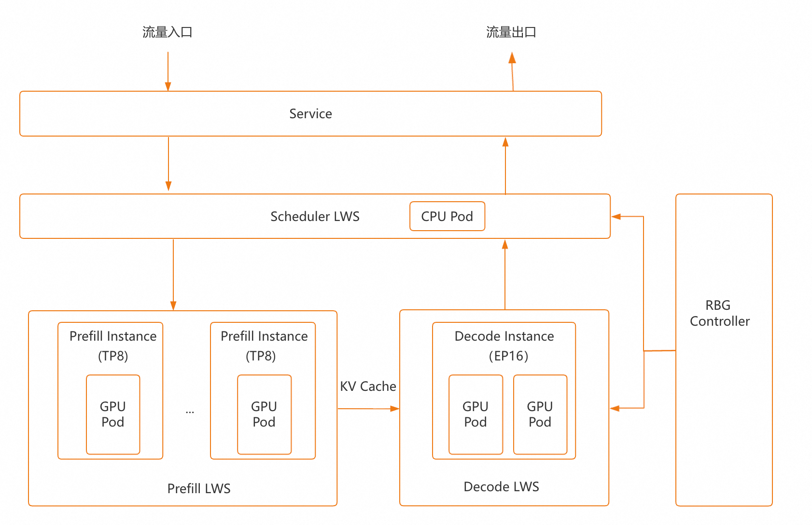
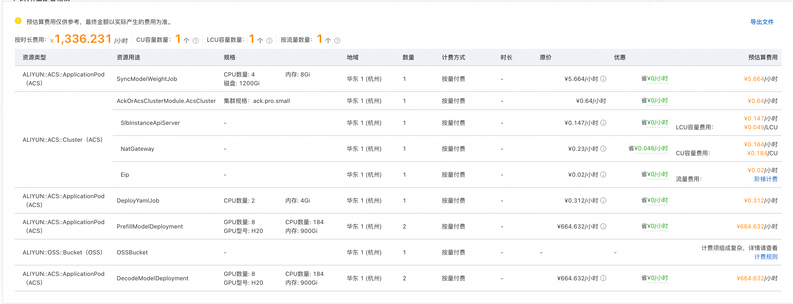
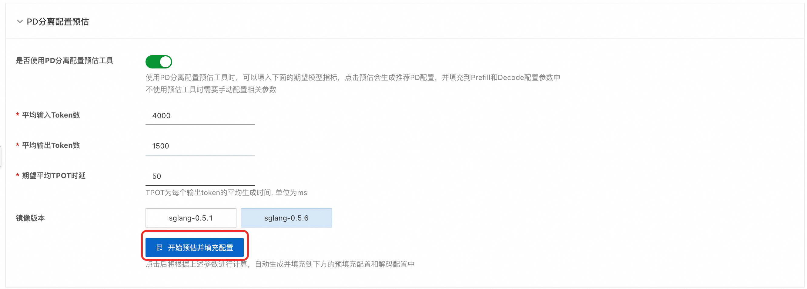
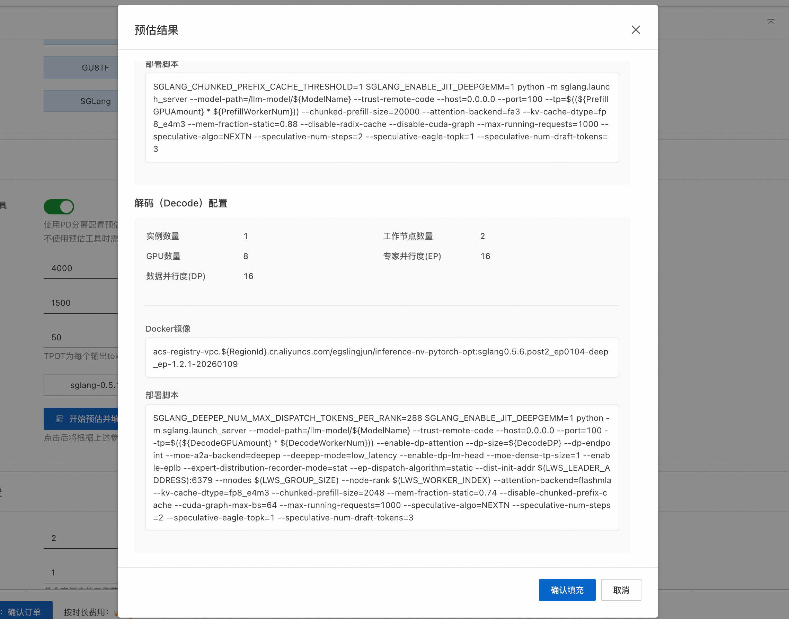
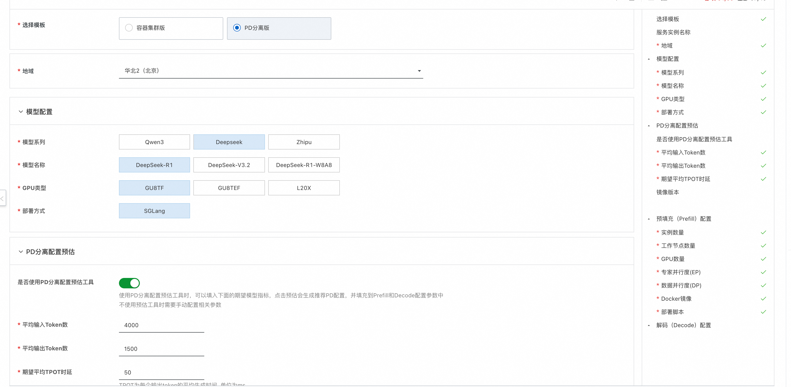
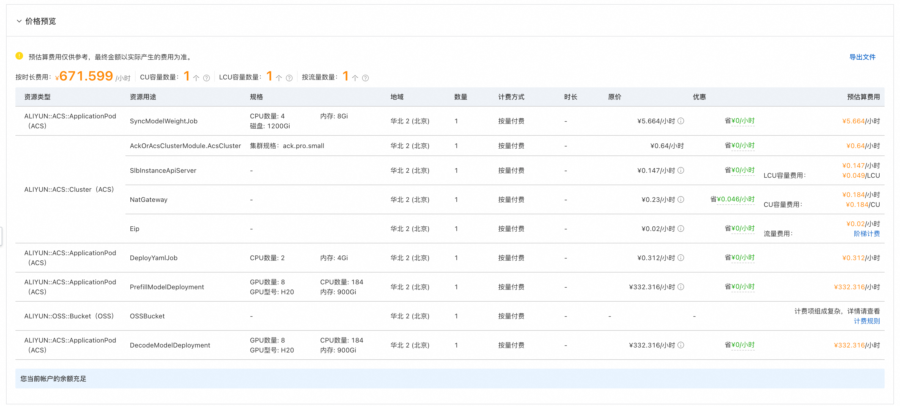
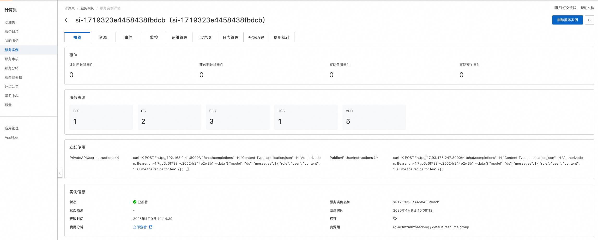

# PD-Disaggregated Deployment on Container Clusters

## Overview

This solution is jointly developed by ComputeNest and the ACS Performance Optimization Team, providing an out-of-the-box PD-disaggregated (Prefill-Decode disaggregated) deployment solution for Large Language Models (LLMs). It enables production-grade, high-performance inference services without the need to manually configure complex infrastructure. Built on Alibaba Cloud Container Compute Service (ACS) clusters, this solution leverages the PD-disaggregated architecture along with Expert Parallelism optimization, delivering ultimate performance for MoE (Mixture of Experts) models.

Currently supported models include the Qwen, DeepSeek, GLM series and other full-scale models for rapid deployment.

## Architecture



The PD-disaggregated deployment architecture consists of two main layers: the **Scheduling Layer** and the **Inference Layer**.

- **Scheduling Layer**: Managed by the Scheduler (LWS). External traffic is routed here via the Service, and the scheduler dispatches requests to the Inference Layer.
- **Inference Layer**: Split into two stages — Prefill and Decode. The Prefill stage processes input tokens in parallel, then passes the intermediate results (KV Cache) to the Decode stage for autoregressive token-by-token generation.

The key advantage of this disaggregated architecture is that the Prefill stage is compute-intensive, while the Decode stage is memory-bandwidth-intensive with high GPU memory requirements. By decoupling the two, each can be scaled independently. A typical configuration is 2P1D (2 Prefill instances + 1 Decode instance), where the Decode side uses tensor parallelism across multiple GPUs (e.g., 16 GPUs) to expand available memory, thereby supporting efficient inference for ultra-large-scale models.

## Billing

The ComputeNest service itself is free of charge. You only pay for the resources consumed during deployment, and the estimated costs are displayed during the cost estimation phase.

ACS clusters use a serverless billing model, where deployed Pods are billed based on usage and duration. The cost estimation is shown below:


The costs for model service deployment on ACS clusters mainly consist of two parts:

1. **Ongoing resource costs for running the model service:**
   - Pod-related costs for model inference, corresponding to resource type `ALIYUN::ACS::ApplicationPod` with usage labeled as `PrefillModelDeployment` and `DecodeModelDeployment` in the figure above. This includes GPU, CPU cores, and memory costs, depending on the quantity used.
   - OSS Bucket storage costs.
   - SLB, NAT Gateway, and EIP costs for the ACS cluster control plane and cluster management.

2. **One-time costs incurred during model service deployment** (refer to ACS billing documentation for details):
   - Costs for the model weight synchronization Job, corresponding to resource type `ALIYUN::ACS::ApplicationPod` with usage labeled as `SyncModelWeightJob` in the figure above, including Pod CPU cores, memory, and attached disk costs. Note that model weight synchronization is a one-time cost — for subsequent deployments, you can select an existing Bucket and skip the weight synchronization process.
   - Costs for the deployment Job, corresponding to resource type `ALIYUN::ACS::ApplicationPod` with usage labeled as `DeployYamlJob` in the figure above, including Pod CPU cores and memory costs.

## Required RAM Account Permissions

For the required RAM account permissions, refer to the deployment permissions section in the [official documentation](https://help.aliyun.com/zh/compute-nest/use-cases/computing-nest-model-market-container-cluster-deployment-best-practices).

## PD-Disaggregated Configuration Estimation

This solution provides a **PD-Disaggregated Configuration Estimation Tool** to help you quickly determine the number of Prefill and Decode nodes and their resource configurations based on your workload. Usage instructions:

1. In the "PD-Disaggregated Configuration Estimation" section, enter the **average input token count**, **average output token count**, and **expected average TPOT latency**, then click the **Start Estimation and Fill Configuration** button.
   

2. The system will display the recommended Prefill and Decode node configurations (including node count, GPU specifications, etc.) in a popup. After confirming the settings, click **Confirm and Fill** to automatically populate the Prefill and Decode configuration forms below.
   

## Deployment Steps

1. Click the [deployment link](https://computenest.console.aliyun.com/service/instance/create/cn-hangzhou?type=user&ServiceId=service-c8bf02afe7544025be47). Fill in the parameters as prompted on the page. You can view the pricing details, and after confirming the parameters, click **Next: Confirm Order**.
    

2. After clicking **Next: Confirm Order**, you can also view the price preview. Then click **Deploy Now** and wait for the deployment to complete.
   

3. Once the deployment is complete, you can start using the service. Go to the service instance details page to view the private network access guide. If you selected **Enable Public Access**, you will also see the public access guide.
   

## Usage Guide

### Private Network API Access

1. Access the **Private API Address** shown on the overview page from an ECS instance within the same VPC as the server. Example:

```shell
# Private network authenticated request with streaming. To disable streaming, remove the stream parameter.
curl http://{$PrivateIP}:8000/v1/chat/completions \
  -H "Content-Type: application/json" \
  -H "Authorization: Bearer ${API_KEY}" \
  -d '{
    "model": "ds",
    "messages": [
      {
        "role": "user",
        "content": "Write a letter to my daughter from the year 2035, encouraging her to study science and technology well, to be a master of technology, and to drive technological and economic development. She is currently in 3rd grade."
      }
    ],
    "max_tokens": 1024,
    "temperature": 0,
    "top_p": 0.9,
    "seed": 10,
    "stream": true
  }'
```

### Public Network API Access
1. To access the API via public network, if you selected **Enable Public Access** during deployment, you can directly access it through the public IP. Example:
```shell
curl http://${PublicIp}:8000/v1/chat/completions \
  -H "Content-Type: application/json" \
  -d '{
    "model": "ds",
    "messages": [
      {
        "role": "user",
        "content": "Write a letter to my daughter from the year 2035, encouraging her to study science and technology well, to be a master of technology, and to drive technological and economic development. She is currently in 3rd grade."
      }
    ],
    "max_tokens": 1024,
    "temperature": 0,
    "top_p": 0.9,
    "seed": 10,
    "stream": true
  }'
```
