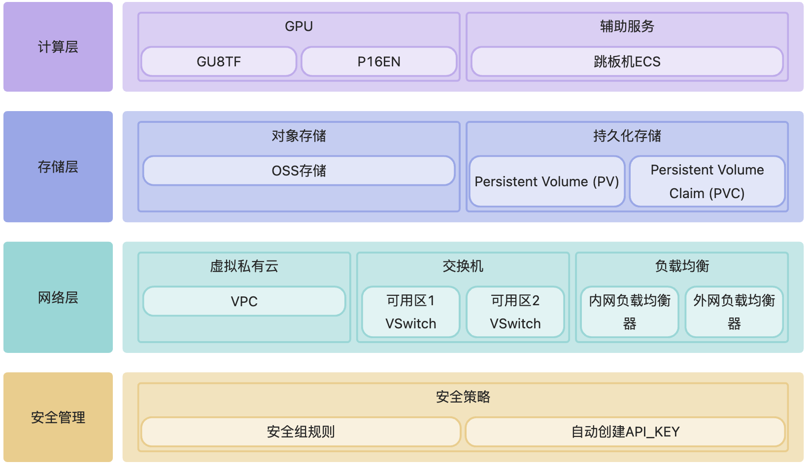
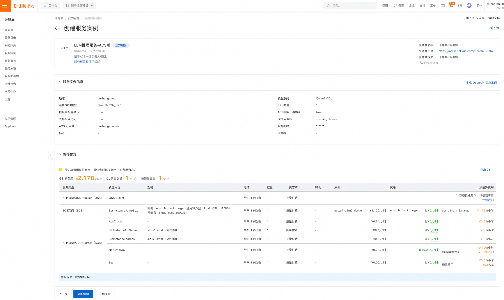

# 基于ACS集群的vllm大模型部署文档

## 部署说明

本方案通过阿里云计算巢服务实现开箱即用的大模型推理服务部署，基于以下核心组件：

- **vLLM**：提供高性能并行推理能力，支持低延迟、高吞吐的LLM推理（支持Qwen、DeepSeek全系列模型）
- **ACS集群**：提供全托管的Kubernetes环境，支持Serverless工作负载弹性伸缩
- **PPU/H20 GPU加速**：支持多种算力规格，满足不同模型规模的推理需求

部署后，用户可通过私有/公网API调用模型服务，资源利用率提升数倍，开发者无需关注底层容器编排与资源调度，仅需在计算巢控制台页面选择模型即可完成一键部署。

### 支持模型清单

| 模型系列             | 支持GPU类型        | 可选数量范围          |
|------------------|----------------|-----------------|
| QwQ-32b          | H20            | 1/2/4/8         |
| Qwen3-32b        | H20/PPU        | 1/2/4/8/16（PPU） |
| Qwen3-235b-A22b  | H20/PPU        | 8/16（PPU）       |
| DeepSeek-R1-32b  | H20/H20-3e/PPU | 1/2/4/8/16（PPU） |
| DeepSeek-R1-70b  | H20/H20-3e/PPU | 2/4/8/16（PPU）   |
| DeepSeek-R1-671b | H20/H20-3e/PPU | 8/16（PPU）       |

## 整体架构



## 计费说明

| 资源类型   | 计费模式 | 关键配置说明                                     |
|--------|------|--------------------------------------------|
| ACS集群  | 按量付费 | 根据所选GPU类型和数量计费，H20/H20-3e/PPU规格不同价格不同      |
| ECS跳板机 | 按量付费 | ecs.u1-c1m2.xlarge（4C8G），用于集群管理，部署完成后可安全释放 |
| OSS存储  | 按量付费 | 存储模型文件，建议选择与集群同地域的存储类型                     |
| NAT网关  | 按量付费 | 当开启公网访问时自动创建，按使用时长和带宽计费                    |

## RAM账号所需权限

部署实例需要对部分阿里云资源进行访问和创建操作。因此您的账号需要包含如下资源的权限。且需要开通ACS服务，开通后可以在ACS控制台右上角看到：
**开通状态：GPU 按量付费已开通, GPU 容量预留已开通, CPU 按量付费已开通**。

| 权限策略名称                          | 备注                         |
|---------------------------------|----------------------------|
| AliyunECSFullAccess             | 管理云服务器服务（ECS）的权限           |
| AliyunVPCFullAccess             | 管理专有网络（VPC）的权限             |
| AliyunROSFullAccess             | 管理资源编排服务（ROS）的权限           |
| AliyunCSFullAccess              | 管理容器服务（CS）的权限              |
| AliyunComputeNestUserFullAccess | 管理计算巢服务（ComputeNest）的用户侧权限 |
| AliyunOSSFullAccess             | 管理网络对象存储服务（OSS）的权限         |

除此之外，**部署前需要联系PDSA添加GPU白名单。**

## 部署流程

1. 单击[部署链接](https://computenest.console.aliyun.com/service/instance/create/cn-hangzhou?type=user&ServiceName=LLM%E6%8E%A8%E7%90%86%E6%9C%8D%E5%8A%A1-ACS%E7%89%88)
。根据界面提示填写参数，可以看到对应询价明细，确认参数后点击**下一步：确认订单**。
    

2. 点击**下一步：确认订单**后可以也看到价格预览，随后点击**立即部署**，等待部署完成。
   

3. 等待部署完成后就可以开始使用服务，进入服务实例详情查看如何私网访问指导。如果选择了**支持公网访问**，则能看到公网访问指导。
   

## 使用说明

### 私网API访问

1. 在和服务器同一VPC内的ECS中访问概览页的**私网API地址**。访问示例如下：

```shell
# 私网有认证请求，流式访问，若想关闭流式访问，删除stream即可。
curl http://{$PrivateIP}:8000/v1/chat/completions \
  -H "Content-Type: application/json" \
  -H "Authorization: Bearer ${API_KEY}" \
  -d '{
    "model": "ds",
    "messages": [
      {
        "role": "user",
        "content": "给闺女写一份来自未来2035的信，同时告诉她要好好学习科技，做科技的主人，推动科技，经济发展；她现在是3年级"
      }
    ],
    "max_tokens": 1024,
    "temperature": 0,
    "top_p": 0.9,
    "seed": 10,
    "stream": true
  }'
```

2. 如果想通过公网访问API地址，部署时如果选择了**支持公网访问**，则直接通过公网IP访问即可，示例如下：
```shell
curl http://${PublicIp}:8000/v1/chat/completions \
  -H "Content-Type: application/json" \
  -d '{
    "model": "ds",
    "messages": [
      {
        "role": "user",
        "content": "给闺女写一份来自未来2035的信，同时告诉她要好好学习科技，做科技的主人，推动科技，经济发展；她现在是3年级"
      }
    ],
    "max_tokens": 1024,
    "temperature": 0,
    "top_p": 0.9,
    "seed": 10,
    "stream": true
  }'
```
如果未选择**支持公网访问**，则需要手动在集群中创建一个`LoadBalance`
，示例如下（deepseek-r1，如果是qwq-32b，labels.app需要改为qwq-32b)：

```yaml
apiVersion: v1
kind: Service
metadata:
  annotations:
    service.beta.kubernetes.io/alibaba-cloud-loadbalancer-address-type: "internet"
    service.beta.kubernetes.io/alibaba-cloud-loadbalancer-ip-version: ipv4
  labels:
    app: deepseek-r1
  name: svc-public
  namespace: llm-model
spec:
  externalTrafficPolicy: Local
  ports:
    - name: serving
      port: 8000
      protocol: TCP
      targetPort: 8000
  selector:
    app: deepseek-r1
  type: LoadBalancer
```

### 重新部署模型

**对于不更换模型、仅改变部署参数的情况，可以参考如下说明重新部署模型：**

通过跳板机上执行kubectl apply命令或者直接在控制台手动输入模板来重新部署。

1. 跳板机方式
    1. 进入计算巢控制台服务实例的资源界面，可以看到对应的ECS跳板机，执行**远程连接**，选择免密登录。
       
    2. 进入跳板机后执行命令
         ```bash
         [root@iZ0jl6qbv1gs36mzvvl1gaZ ~]# cd /root
         [root@iZ0jl6qbv1gs36mzvvl1gaZ ~]# ls
         download.log  kubectl  llm-k8s-resource  llm-k8s-resource.tar.gz  llm-model  logtail.sh  ossutil-2.1.0-linux-amd64  ossutil-2.1.0-linux-amd64.zip
         [root@iZ0jl6qbv1gs36mzvvl1gaZ ~]# cd llm-k8s-resource/
         [root@iZ0jl6qbv1gs36mzvvl1gaZ llm-k8s-resource]# ll
         total 28
         -rw-r--r-- 1  502 games 2235 Apr 14 17:54 deepseek-h20-application.yaml
         -rw-r--r-- 1  502 games 3348 Apr 14 17:54 deepseek-ppu-application.yaml
         -rw-r--r-- 1 root root  2594 Apr 16 10:04 model.yaml
         -rw-r--r-- 1  502 games  930 Apr 16 10:04 pre-deploy-application.yaml
         -rw-r--r-- 1  502 games  426 Apr 16 10:21 private-service.yaml
         -rw-r--r-- 1  502 games  456 Apr 16 10:21 public-service.yaml
         -rw-r--r-- 1  502 games 2586 Apr 14 17:30 qwq-application.yaml
      
         # 如果需要更改模型参数，修改了model.yaml后直接执行apply命令即可
         kubectl apply -f /root/llm-k8s-resource/model.yaml
         ```

2. 控制台方式
    1. 进入计算巢控制台，点击**服务实例**，点击**资源**，找到对应的ACS实例，点击进入。
       
    2. 进入ACS控制台后点击**工作负载**，查看**无状态**，以qwq-32b为例：可以看到对应的Deployment。
       
    3. 点击该Deployment后进入详情页面，点击编辑可以修改一些基本参数，或者点击查看yaml修改后更新。
       

**对于更换模型的情况，可以参考如下文档：**

[ACS集群形态的LLM大模型推理镜像使用指导_PG1阿里云产品-阿里云帮助中心](https://help.aliyun.com/document_detail/2864595.html)
[使用ACS GPU算力构建DeepSeek满血版模型推理服务_容器计算服务(ACS)-阿里云帮助中心](https://help.aliyun.com/zh/cs/user-guide/use-acs-gpu-computing-power-to-build-deepseek-full-model-reasoning-service)

### 进阶教程

- 除了部署服务实例时可以选择**Fluid配置**，也可以后续自定义配置Fluid实现模型加速

  Fluid 是一种基于 Kubernetes 原生的分布式数据集编排和加速引擎，旨在优化数据密集型应用（如AI推理、大模型训练等场景）的性能。如果服务需要在弹性伸缩时快速启动，
  可以考虑部署Fluid，具体可以参考文档：[Fluid](https://help.aliyun.com/zh/cs/user-guide/using-acs-gpu-computing-power-to-build-a-distributed-deepseek-full-blood-version-reasoning-service)。
  经测试，采用Fluid的加速，根据缓存大小，模型加载速度可以缩短至50%，在应对一些弹性伸缩的场景下，可以快速加载模型，显著提高性能。如下所示，可以仅修改具体的BucketName、ModelName和具体的JindoRuntime参数：

```yaml
apiVersion: data.fluid.io/v1alpha1
kind: Dataset
metadata:
  name: llm-model
  namespace: llm-model
spec:
  placement: Shared
  mounts:
    - mountPoint: oss://${BucketName}/llm-model
      options:
        fs.oss.endpoint: oss-${RegionId}-internal.aliyuncs.com
      name: models
      path: "/"
      encryptOptions:
        - name: fs.oss.accessKeyId
          valueFrom:
            secretKeyRef:
              name: oss-secret
              key: akId
        - name: fs.oss.accessKeySecret
          valueFrom:
            secretKeyRef:
              name: oss-secret
              key: akSecret
---
apiVersion: data.fluid.io/v1alpha1
kind: JindoRuntime
metadata:
  name: llm-model
  namespace: llm-model
spec:
  networkmode: ContainerNetwork
  replicas: ${JindoRuntimeReplicas} # 设置副本数,根据实际的模型磁盘占用进行设置
  master:
    podMetadata:
      labels:
        alibabacloud.com/compute-class: performance
        alibabacloud.com/compute-qos: default
  worker:
    podMetadata:
      labels:
        alibabacloud.com/compute-class: performance
        alibabacloud.com/compute-qos: default
      annotations:
        kubernetes.io/resource-type: serverless
    resources:
      requests:
        cpu: 16
        memory: 128Gi
      limits:
        cpu: 16
        memory: 128Gi
  tieredstore:
    levels:
      - mediumtype: MEM
        path: /dev/shm
        volumeType: emptyDir
        quota: 128Gi
        high: "0.99"
        low: "0.95"
---
apiVersion: data.fluid.io/v1alpha1
kind: DataLoad
metadata:
  name: llm-model
  namespace: llm-model
spec:
  dataset:
    name: llm-model
    namespace: llm-model
  loadMetadata: true
```

### Benchmark

本服务基采用vllm自带的benchmark进行测试，采用的压测数据集：[https://www.modelscope.cn/datasets/gliang1001/ShareGPT_V3_unfiltered_cleaned_split/files](https://www.modelscope.cn/datasets/gliang1001/ShareGPT_V3_unfiltered_cleaned_split/files)，
整体压测流程：

1. 创建一个Deployment，使用vllm-benchmark镜像。在容器中执行数据集下载、压测操作
   使用下面的yaml创建Deployment前需要替换部分参数

| 替换参数                     | 参数含义                    | 参数值示例/说明                                                                                                                                                                                                                                                                                                                                          |
 |--------------------------|-------------------------|---------------------------------------------------------------------------------------------------------------------------------------------------------------------------------------------------------------------------------------------------------------------------------------------------------------------------------------------------|
| **`$POD_IP`**            | 运行 deepseek-r1 的 Pod IP | `kubectl get pod -n llm-model -l app=$(kubectl get deployment -n llm-model -l app -o jsonpath='{.items[0].spec.template.metadata.labels.app}') -o jsonpath='{.items[0].status.podIP}'`                                                                                                                                                            |
| **`$API_KEY`**           | 服务认证密钥                  | 在服务实例详情页中获取（形如 `sk-xxxxxxxxxxxxxxxxxxxxxxxxxxxxxxxx`）                                                                                                                                                                                                                                                                                             |
| **`$MODEL_PATH`**        | 模型存储路径                  | QwQ-32b: `/llm-model/Qwen/QwQ-32B`<br>Qwen3-32b: `/llm-model/Qwen/Qwen3-32B`<br>Qwen3-235b-A22b: `/llm-model/Qwen/Qwen3-235B-A22B`<br>DeepSeek-R1_671b: `/llm-model/deepseek-ai/DeepSeek-R1`<br>DeepSeek-R1_32b: `/llm-model/deepseek-ai/DeepSeek-R1-Distill-Qwen-32B`<br>DeepSeek-R1_70b: `/llm-model/deepseek-ai/DeepSeek-R1-Distill-Llama-70B` |
| **`$SERVED_MODEL_NAME`** | 服务部署的模型名称               | QwQ-32b: `qwq-32b`<br>Qwen3-32b: `qwen3`<br>Qwen3-235b-A22b: `qwen3`<br>DeepSeek-R1_671b: `deepseek-r1`<br>DeepSeek-R1_32b: `deepseek-r1`<br>DeepSeek-R1_70b: `deepseek-r1`                                                                                                                                                                       |

```yaml 
apiVersion: apps/v1
kind: Deployment
metadata:
  name: vllm-benchmark
  namespace: llm-model
  labels:
    app: vllm-benchmark
spec:
  replicas: 1
  selector:
    matchLabels:
      app: vllm-benchmark
  template:
    metadata:
      labels:
        app: vllm-benchmark
    spec:
      volumes:
        - name: llm-model
          persistentVolumeClaim:
            claimName: llm-model
      containers:
        - name: vllm-benchmark
          image: kube-ai-registry.cn-shanghai.cr.aliyuncs.com/kube-ai/vllm-benchmark:v1
          command:
            - "sh"
            - "-c"
            - |
              # 安装依赖
              yum install -y epel-release && \
              yum install -y git git-lfs && \
              git lfs install &&

              # 下载数据集
              git clone https://www.modelscope.cn/datasets/gliang1001/ShareGPT_V3_unfiltered_cleaned_split.git /root/ShareGPT_V3_unfiltered_cleaned_split

              # 执行基准测试
              export OPENAI_API_KEY=$API_KEY
              python3 /root/vllm/benchmarks/benchmark_serving.py \
                --backend vllm \
                --model $MODEL_PATH \
                --served-model-name $SERVED_MODEL_NAME \
                --trust-remote-code \
                --dataset-name sharegpt \
                --dataset-path /root/ShareGPT_V3_unfiltered_cleaned_split/ShareGPT_V3_unfiltered_cleaned_split.json \
                --sonnet-input-len 1024 \
                --sonnet-output-len 6 \
                --sonnet-prefix-len 50 \
                --num-prompts 200 \
                --request-rate 1 \
                --host $POD_IP \
                --port 8000 \
                --endpoint /v1/completions \
                --save-result

              # 保持容器运行
              sleep inf
          volumeMounts:
            - mountPath: /llm-model
              name: llm-model
```

2. 直接在acs控制台查看容器日志或者进入容器查看容器日志
   

   测试结果示例：
    ```plaintext
    ============ Serving Benchmark Result ============
    Successful requests:                     200       
    Benchmark duration (s):                  272.15    
    Total input tokens:                      43390     
    Total generated tokens:                  39980     
    Request throughput (req/s):              0.73      
    Output token throughput (tok/s):         146.91    
    Total Token throughput (tok/s):          306.34    
    ---------------Time to First Token----------------
    Mean TTFT (ms):                          246.46    
    Median TTFT (ms):                        244.58    
    P99 TTFT (ms):                           342.11    
    -----Time per Output Token (excl. 1st token)------
    Mean TPOT (ms):                          130.30    
    Median TPOT (ms):                        130.12    
    P99 TPOT (ms):                           139.09    
    ---------------Inter-token Latency----------------
    Mean ITL (ms):                           129.89    
    Median ITL (ms):                         125.40    
    P99 ITL (ms):                            173.20    
    ==================================================
    ```