# LLM model deployment document based on single ECS instance

## Deployment Instructions
This service provides a one-click deployment solution for large models based on ECS mirroring and VLLM. The QwQ-32B model can be deployed in 10 minutes and the Qwen3-235B-A22B model can be deployed in 30 minutes.

This service uses ECS mirror packaging standard environments and realizes one-click deployment of cloud resources and large models through Ros templates. Developers do not need to care about the standard environment for model deployment and operation and the underlying cloud resource orchestration. They only need to add a few parameters to enjoy the inference experience of mainstream LLMs (such as Qwen, DeepSeek, etc.).

The models supported by this service are as follows:
* [Qwen/Qwen3-235B-A22B](https://www.modelscope.cn/models/Qwen/Qwen3-235B-A22B/)
* [Qwen/Qwen3-32B](https://www.modelscope.cn/models/Qwen/Qwen3-32B)
* [Qwen/QwQ-32B](https://www.modelscope.cn/models/Qwen/QwQ-32B)
* [Qwen/Qwen2.5-32B-Instruct](https://www.modelscope.cn/models/Qwen/Qwen2.5-32B-Instruct)
* [deepseek-ai/DeepSeek-R1-Distill-Llama-70B](https://www.modelscope.cn/models/deepseek-ai/DeepSeek-R1-Distill-Llama-70B)
* [deepseek-ai/DeepSeek-R1-Distill-Qwen-32B](https://www.modelscope.cn/models/deepseek-ai/DeepSeek-R1-Distill-Qwen-32B)
* [deepseek-ai/DeepSeek-R1-Distill-Qwen-7B](https://www.modelscope.cn/models/deepseek-ai/DeepSeek-R1-Distill-Qwen-7B)

## Overall architecture
### User/Client Layer
* Access Method: Users can connect via Private VPC or Public Network.
* Security Measures: Utilizes an API Key for secure access.
* Response Mode: Supports streaming returns for real-time data processing.
### Service Layer
* Large-Scale Services: This layer provides large model services.
* Standard API Interface: It offers standardized API calls for easy integration and usage.
* Recommendation Engine: The service features a recommendation engine powered by VLLM services.
### Infrastructure Layer
* Network: It features a Virtual Private Cloud (VPC) network for secure data transmission.
* Computational Resources: This includes ECS image and ECS GPU instances for scalable computing power.
* ECS Image Contents: The layer manages the ECS image, which comprises the environment for running VLLM, as well as large model files.

## Billing instructions
The cost of this service on Alibaba Cloud mainly involves:
* Specifications of the selected GPU cloud server
* Number of nodes
* Disk capacity
* Public network bandwidth
Billing method: pay by volume (hours) or annual monthly payment
Estimated costs are visible in real time when creating an instance.

## Required permissions for RAM account

To deploy service instances, some Alibaba Cloud resources need to be accessed and created.Therefore, your account needs permissions to include the following resources.

| Permission Policy Name | Notes |
|---------------------------------|----------------------------|
| AliyunECSFullAccess | Permissions to manage cloud server services (ECS) |
| AliyunVPCFullAccess | Permissions to manage proprietary networks (VPCs) |
| AliyunROSFullAccess | Permissions to manage resource orchestration services (ROS) |
| AliyunComputeNestUserFullAccess | Manage user-side permissions for ComputeNest |

## Deployment Process

1. Click [Deployment Link] (https://computenest.console.aliyun.com/service/instance/create/cn-hangzhou?type=user&ServiceName=LLM Inference Service (ECS Version)).Select standalone version.Fill in the parameters according to the prompts on the interface, and you can choose whether to turn on the public network according to your needs. You can see the corresponding inquiry details. After confirming the parameters, click Next: Confirm the order**.


2. Click **Next: Confirm the order ** and you can see the price preview. Then you can click **Deploy now** and wait for the deployment to complete.(If the RAM permission is insufficient, you need to add RAM permissions to the sub-account)

3. After the deployment is completed, you can start using the service.Click on the service instance name to enter the service instance details, and use the Api to call the sample to access the service.If it is an intranet access, you must ensure that the ECS instance is under the same VPC.


4. After ssh accesses the ECS instance, execute docker logs vllm to query the model service deployment log.When you see the result shown in the figure below, it means that the model service is deployed successfully.The path where the model is located is /root/llm_model/.
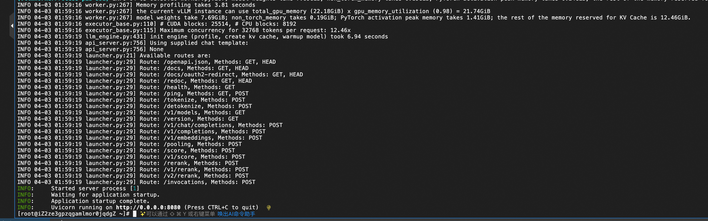

## Instructions for use

### Query model deployment parameters

1. Copy the service instance name.Go to [Resource Orchestration Console] (https://ros.console.aliyun.com/cn-hangzhou/stacks) to view the corresponding resource stack.


2. Enter the resource stack corresponding to the service instance, you can see all the resources opened and view all the scripts executed during the model deployment process.


### Customize model deployment parameters
If you have the requirement for custom model deployment parameters, you can modify it after deploying the service instance as follows.

1. Remotely connect and log in to the ECS instance.

2. Execute the following command to stop the model service.
    ```shell
    sudo docker stop vllm
    sudo docker rm vllm
3. Please refer to the Query Model Deployment Parameters section in this document to obtain the scripts that the model deployment actually executes.
4. The following are the reference scripts for vllm and sglang deployments. You can refer to the parameters to annotate custom model deployment parameters and modify the actual executed script.
* vllm deployment reference script
    ```shell
    docker run -d -t --net=host --gpus all \
    --entrypoint /bin/bash \
    --privileged \
    --ipc=host \
    --name vllm \
    -v /root:/root \
    egs-registry.cn-hangzhou.cr.aliyuncs.com/egs/vllm:0.7.2-pytorch2.5.1-cuda12.4-ubuntu22.04 \
    -c "pip install --upgrade vllm==0.8.2 && # Customizable version, such as pip install vllm==0.7.1
    export GLOO_SOCKET_IFNAME=eth0 && # Use vpc for network communication environment variables, do not delete and modify
    export NCCL_SOCKET_IFNAME=eth0 && # Use vpc for network communication environment variables, do not delete and modify
    vllm serve /root/llm-model/${ModelName} \
    --served-model-name ${ModelName} \
    --gpu-memory-utilization 0.98 \ # Gpu occupancy rate, too high may cause other processes to trigger OOM.Value range: 0~1
    --max-model-len ${MaxModelLen} \ # The maximum length of the model, the value range is related to the model itself.
    --enable-chunked-prefill \
    --host=0.0.0.0 \
    --port 8080 \
    --trust-remote-code \
    --api-key "${VLLM_API_KEY}" \ # Optional, can be removed if not required.
    --tensor-parallel-size $(nvidia-smi --query-gpu=index --format=csv,noheader | wc -l | awk '{print $1}')" # Number of GPUs used, all GPUs are used by default.
* sglang deployment reference script
    ```shell
    #Download a public image containing sglang
    docker pull egs-registry.cn-hangzhou.cr.aliyuncs.com/egs/vllm:0.7.2-sglang0.4.3.post2-pytorch2.5-cuda12.4-20250224
    
    Docker run -d -t --net=host --gpus all \
    --entrypoint /bin/bash \
    --privileged \
    --ipc=host \
    --name llm-server \
    -v /root:/root \
    egs-registry.cn-hangzhou.cr.aliyuncs.com/egs/vllm:0.7.2-sglang0.4.3.post2-pytorch2.5-cuda12.4-20250224 \
    -c "pip install sglang==0.4.3 && # Customizable version
    export GLOO_SOCKET_IFNAME=eth0 && # Use vpc for network communication environment variables, do not delete and modify
    export NCCL_SOCKET_IFNAME=eth0 && # Use vpc for network communication environment variables, do not delete and modify
    python3 -m sglang.launch_server \
    --model-path /root/llm-model/${ModelName} \
    --served-model-name ${ModelName} \
    --tp $(nvidia-smi --query-gpu=index --format=csv,noheader | wc -l | awk '{print $1}')" \ # Number of GPUs used, all GPUs are used by default.
    --trust-remote-code \
    --host 0.0.0.0 \
    --port 8080 \
    --mem-fraction-static 0.9 # Gpu occupancy rate, too high may cause other processes to trigger OOM.Value range: 0~1

### Intranet API access
Copy the Api call example and paste the Api call example in the ECS instance of the resource tab.It can also be accessed in other ECS within the same VPC.


### Public Internet API access
Copy the Api call example and paste the Api call example in the local terminal.


## Configure the vLLM API using the Chatbox client for conversation (optional)

1. Visit Chatbox [Download Address] (https://chatboxai.app/zh#download) to download and install the client. This solution takes macOS M3 as an example.

2. Run and configure the vLLM API and click Settings.

3. Configure in the pop-up kanban according to the following table.

| Project | Description | Example Value |
|---------------------------------|----------------------------|----------------------------|
| Model Provider | Pull down to select the model provider.| Add a custom provider |
| Name | Fill in the name of the model provider.| vLLM API |
| API Domain Name | Fill in the model service call address.| http://<ECS public network IP>:8000 |
| API Path | Fill in the API Path.| /v1/chat/completes |
| Network Compatibility | Click to enable to improve network compatibility | Open |
| API Key | Fill in the Model Service Call API Key.| After deploying the service instance, you can get Api_Key on the service instance page
| Model | Fill in the called model.| Qwen/QwQ-32B |

4. Save the configuration.The conversation can be performed in the text input box.Enter the question Who are you?Or after other instructions, the model service is called to obtain the corresponding response.

## Performance Testing

### Pressure test process (for reference)
>**Prerequisites: ** 1. It is impossible to directly test model services with API-key; 2. Public network is required.
#### Redeploy the model service
1. Remotely connect and log in to the ECS instance.
   
2. Execute the following command to stop the model service.
    ```shell
    sudo docker stop vllm
    sudo docker rm vllm
3. Please refer to the Query Model Deployment Parameters section in this document to obtain the scripts that the model deployment actually executes.
4. Remove the --api-key parameter in the script and execute the remaining scripts in the ECS instance.Execute docker logs vllm.If the result is shown in the figure below, the model service is redeployed successfully.
   
#### Perform performance testing
Taking QwQ-32B as an example, after the model service is deployed, ssh logs into the ECS instance.Execute the following command to get the model service performance test results.You can modify it yourself according to the parameter description.
   ```shell
    yum install -y git-lfs
    git lfs install
    git lfs clone https://www.modelscope.cn/datasets/gliang1001/ShareGPT_V3_unfiltered_cleaned_split.git
    git lfs clone https://github.com/vllm-project/vllm.git
    
    docker exec vllm bash -c "
    pip install pandas datasets &&
    python3 /root/vllm/benchmarks/benchmark_serving.py \
    --backend vllm \
    --model /root/llm-model/Qwen/QwQ-32B \
    --served-model-name Qwen/QwQ-32B \
    --sonnet-input-len 1024 \ # Maximum input length
    --sonnet-output-len 4096 \ # Maximum output length
    --sonnet-prefix-len 50 \ # Prefix length
    --num-prompts 400 \ # Randomly select or process 400 prompts from the dataset for performance testing.
    --request-rate 20 \ # Simulate a stress test of 20 concurrent requests per second, lasting 20 seconds, with a total of 400 requests.Evaluate the throughput and latency of the model service under load.
    --port 8080 \
    --trust-remote-code \
    --dataset-name sharegpt \
    --save-result \
    --dataset-path /root/ShareGPT_V3_unfiltered_cleaned_split/ShareGPT_V3_unfiltered_cleaned_split.json
    "
   ```

#### Qwen3-235B-A22B stress test results

Under this service plan, for Qwen3-235B-A22B, the inference response performance of the model service was tested under the ecs.ebmgn8v.48xlarge (H20) instance specification with a QPS of 20, and the stress test duration was 1 minute.

##### H20 specification
###### QPS is 20, 1200 question and answer requests in 1 minute
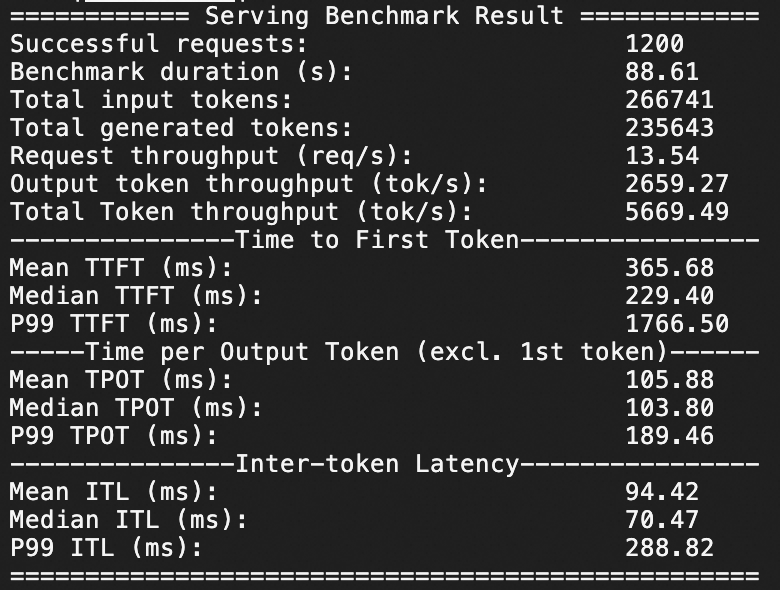

###### QPS is 50, 3000 Q&A requests per minute
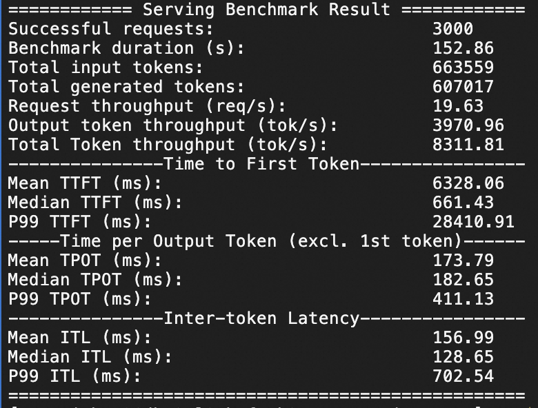

#### Qwen3-32B stress test results

Under this service plan, for Qwen3-32B, the inference response performance of the model service is tested under the ecs.gn7i-8x.16xlarge (8*A10) and ecs.ebmgn8v.48xlarge (H20) instance specifications, respectively, with a QPS of 20. The stress test duration is 1 minute.

##### 8*A10 specification
###### QPS is 20, 1200 Q&A requests per minute
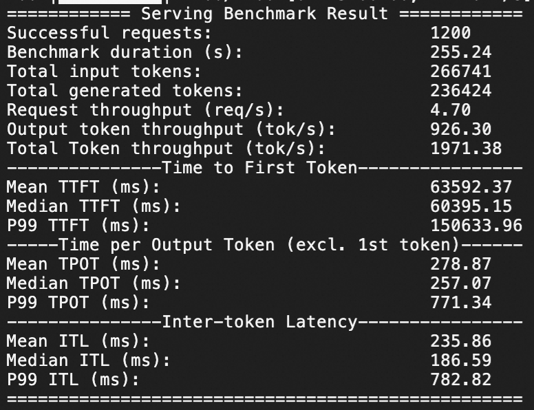

###### QPS is 50, 3000 Q&A requests per minute
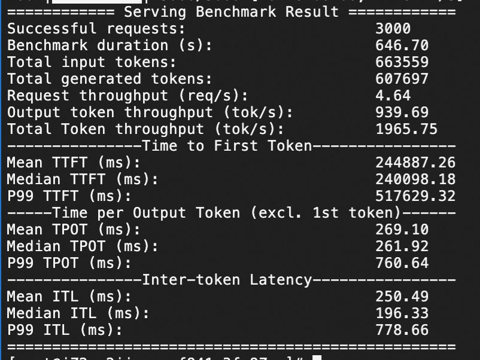

Under this service plan, the inference response performance of the model service under the 4*A10 and 8*A10 instance specifications were tested respectively for the inference response performance of the model service with a QPS of 10, 20 and 50, and the pressure measurement duration was 20s.

### 8*A10 specifications
#### QPS is 10
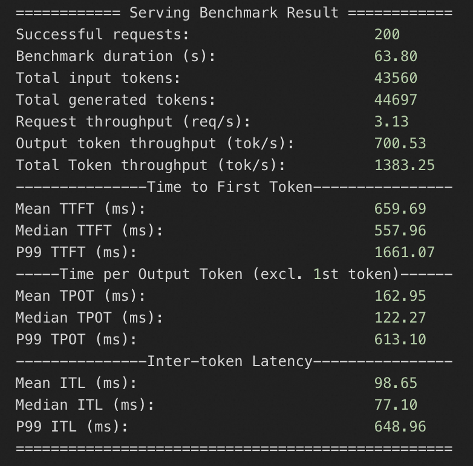

#### QPS is 20
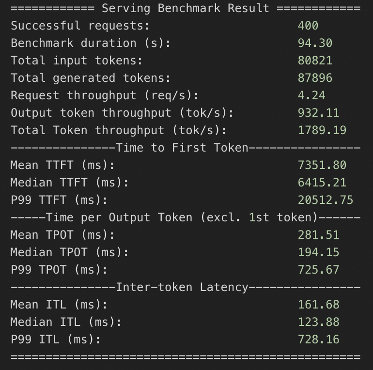

#### QPS is 50
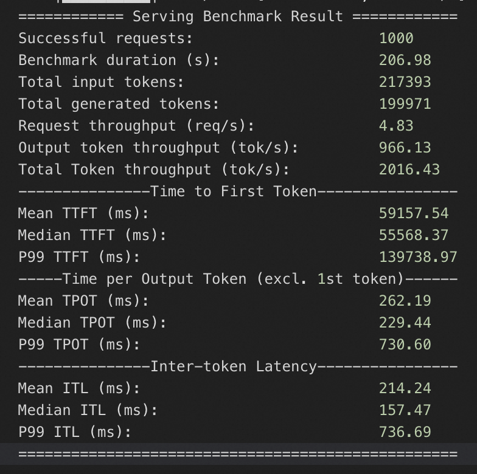

### 4*A10 specifications
#### QPS is 10
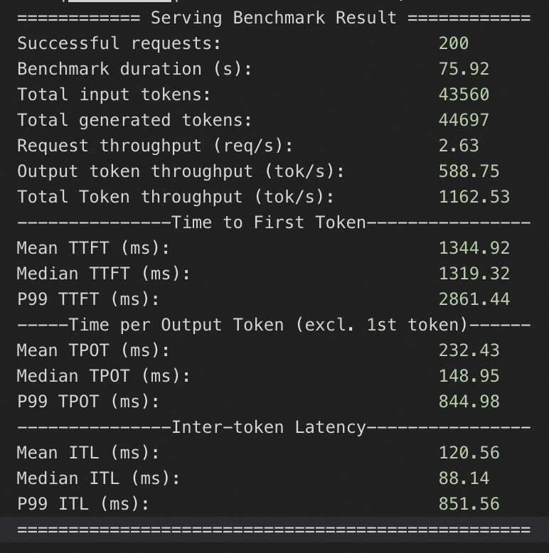

#### QPS is 20
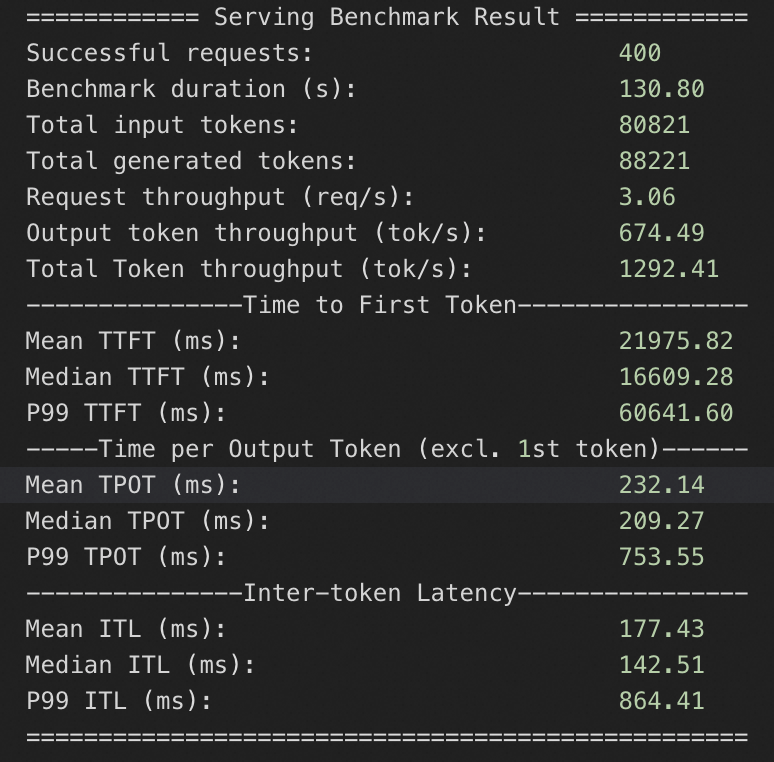

#### QPS is 50
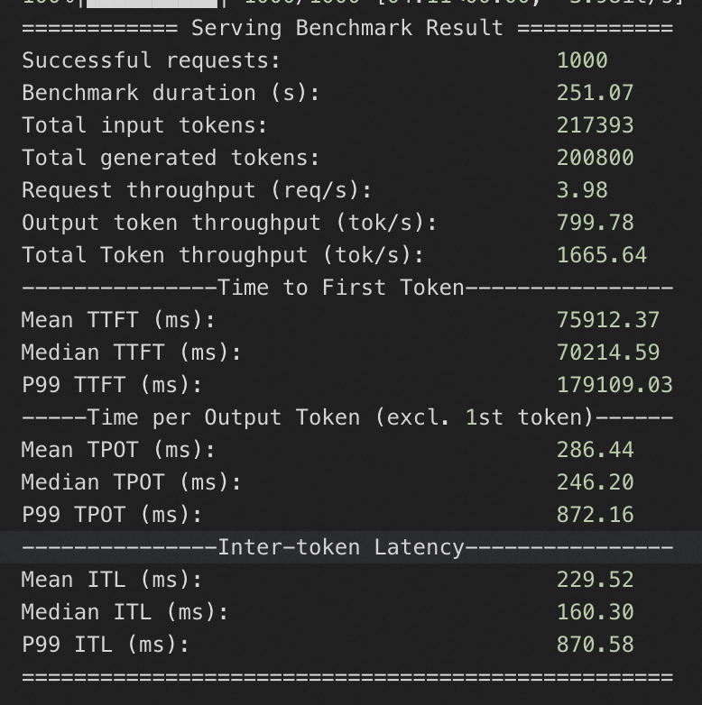