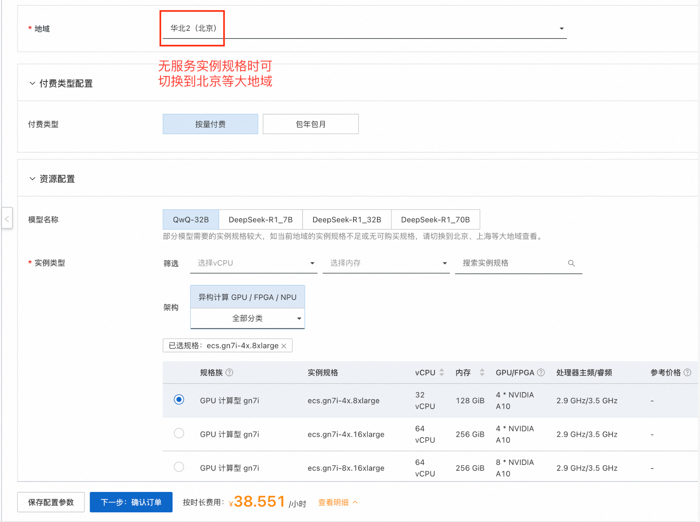

# 基于单ECS实例的LLM模型部署文档

## 部署说明
本服务提供了基于ECS镜像与VLLM的大模型一键部署方案，10分钟即可部署使用QwQ-32B模型，15分钟即可部署使用Deepseek-R1-70B模型。
本服务通过ECS镜像打包标准环境，通过Ros模版实现云资源与大模型的一键部署，开发者无需关心模型部署运行的标准环境与底层云资源编排，仅需添加几个参数即可享受主流LLM（如Qwen、DeepSeek等）的推理体验。
本服务提供的方案下，以平均每次请求的token为10kb计算，采用4张A10卡的服务实例规格，QwQ-32B理论可支持的每秒并发请求数(QPS)约为13.1；采用8张A10卡的服务实例规格，QwQ-32B理论可支持的每秒并发请求数约为24.1，Deepseek-R1-70B约为9.5。
如希望支持模型动态扩缩与QPS自适应调度，可考虑[基于Ack/Acs的部署方案](https://computenest.console.aliyun.com/service/detail/cn-hangzhou/service-fcfc1ea4afaf47bcbadc/beta?isRecommend=true)。

## 整体架构

## 计费说明
本服务在阿里云上的费用主要涉及：
* 所选GPU云服务器的规格
* 节点数量
* 磁盘容量
* 公网带宽
计费方式：按量付费（小时）或包年包月
预估费用在创建实例时可实时看到。

## RAM账号所需权限

部署服务实例，需要对部分阿里云资源进行访问和创建操作。因此您的账号需要包含如下资源的权限。

| 权限策略名称                          | 备注                         |
|---------------------------------|----------------------------|
| AliyunECSFullAccess             | 管理云服务器服务（ECS）的权限           |
| AliyunVPCFullAccess             | 管理专有网络（VPC）的权限             |
| AliyunROSFullAccess             | 管理资源编排服务（ROS）的权限           |
| AliyunComputeNestUserFullAccess | 管理计算巢服务（ComputeNest）的用户侧权限 |

## 部署流程

1. 单击[部署链接](https://computenest.console.aliyun.com/service/instance/create/cn-hangzhou?type=user&ServiceName=LLM推理服务)。根据界面提示填写参数，可根据需求选择是否开启公网，可以看到对应询价明细，确认参数后点击**下一步：确认订单**。
    
    
2. 点击**下一步：确认订单**后可以看到价格预览，随后可点击**立即部署**，等待部署完成。(提示RAM权限不足时需要为子账号添加RAM权限)
    
3. 等待部署完成后，就可以开始使用服务了。点击服务实例名称，进入服务实例详情，使用Api调用示例即可访问服务。如果是内网访问，需保证ECS实例在同一个VPC下。
    
    
    

## 使用说明

### 内网API访问
复制Api调用示例，在资源标签页的ECS实例中粘贴Api调用示例即可。也可在同一VPC内的其他ECS中访问。
    
    
    
### 公网API访问
复制Api调用示例，在本地终端中粘贴Api调用示例即可。
    
    