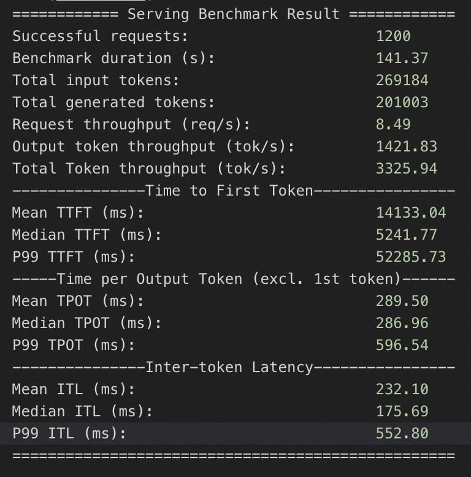

# DeepSeek-R1 and V3 model deployment documents based on dual ECS instances

## Deployment Instructions
This service provides a one-click deployment solution for large models based on ECS mirroring + Vllm + Ray. DeepSeek-R1 full-blood version and DeepSeek-V3 models can be deployed in 30 minutes through dual ECS instances.

This service uses ECS mirror packaging standard environments and realizes one-click deployment of cloud resources and large models through Ros templates. Developers do not need to care about the standard environment for model deployment and operation and the underlying cloud resource orchestration. They only need to add a few parameters to enjoy the inference experience of DeepSeek-R1 full-blooded version and DeepSeek-V3.

Under the scheme provided by this service, the average token per request is calculated by 10kb, and two H20-specification ECS instances can be used. The number of concurrent requests per second (QPS) that can be supported by the DeepSeek-R1 full-blood version theory is about 75, and the DeepSeek-V3 is about 67.

The models supported by this service are as follows:
* [deepseek-ai/DeepSeek-R1](https://www.modelscope.cn/models/deepseek-ai/DeepSeek-R1)
* [deepseek-ai/DeepSeek-V3](https://www.modelscope.cn/models/deepseek-ai/DeepSeek-V3)

## Overall architecture

### User/Client Layer
* Access Method：VPC Internal Access, Public Network Access and API Key Access
* Response Method: Streaming Return

### Service Layer
* Large Model Service: Provide Standard API Interface for Invocation
* VLLM Service: Tensor Parallel Size 8 and Pipeline Parallel Size 2

### Infrastructure Layer
* Network and Resources: Ray Cluster, Dual ECS GPU Instances, ECS Image and VPC Network
* ECS Image: VLLM Standard Operation Environment and Large Model Files

## Billing instructions
The cost of this service on Alibaba Cloud mainly involves:
* Specifications of the selected GPU cloud server
* Number of nodes
* Disk capacity
* Public network bandwidth
Billing method: pay by volume (hours) or annual monthly payment
Estimated costs are visible in real time when creating an instance.

## Required permissions for RAM account

To deploy service instances, some Alibaba Cloud resources need to be accessed and created.Therefore, your account needs permissions to include the following resources.

| Permission Policy Name | Notes |
|---------------------------------|----------------------------|
| AliyunECSFullAccess | Permissions to manage cloud server services (ECS) |
| AliyunVPCFullAccess | Permissions to manage proprietary networks (VPCs) |
| AliyunROSFullAccess | Permissions to manage resource orchestration services (ROS) |
| AliyunComputeNestUserFullAccess | Manage user-side permissions for ComputeNest |

## Deployment Process

1. Click [[Deployment Link]](https://computenest.console.aliyun.com/service/instance/create/ap-southeast-1?type=user&ServiceId=service-0326350f111e4230a9c9).Select the dual-machine version and confirm that the H20 example specification has been applied for.Fill in the parameters according to the prompts on the interface, and you can choose whether to turn on the public network according to your needs. You can see the corresponding inquiry details. After confirming the parameters, click Next: Confirm the order**.


2. Click **Next: Confirm the order ** and you can see the price preview. Then you can click **Deploy now** and wait for the deployment to complete.(If the RAM permission is insufficient, you need to add RAM permissions to the sub-account)

3. After the deployment is completed, you can start using the service.Click on the service instance name to enter the service instance details, and use the Api to call the sample to access the service.If it is an intranet access, you must ensure that the ECS instance is under the same VPC.


4. After ssh accesses the ECS instance, execute docker logs vllm to query the model service deployment log.When you see the result shown in the figure below, it means that the model service is deployed successfully.The path where the model is located is /root/llm_model/.


## Instructions for use

### Query model deployment parameters

1. Copy the service instance name.Go to [Resource Orchestration Console] (https://ros.console.aliyun.com/cn-hangzhou/stacks) to view the corresponding resource stack.


2. Enter the resource stack corresponding to the service instance, you can see all the resources opened and view all the scripts executed during the model deployment process.


### Customize model deployment parameters
If you have the requirement for custom model deployment parameters, you can modify it after deploying the service instance as follows.Currently, two deployment methods are provided: vllm and sglang.

1. Remote connection, log in to the master node and the worker node respectively (the two instances are named llm-xxxx-master and llm-xxxx-worker respectively).


2. Execute the following command to stop the model services in both nodes.
    ```shell
    sudo docker stop vllm
    sudo docker rm vllm

3. Please refer to the Query Model Deployment Parameters section in this document to obtain the scripts that the model deployment is actually executed in the master node and worker node.

4. The following are the reference scripts for vllm and sglang deployments. You can refer to the parameters to annotate custom model deployment parameters and modify the actual executed script.After modification, execute the master node script first, and then execute the worker node script after success.
* vllm deployment master node reference script
    ```shell
    docker run -t -d \
    --entrypoint /bin/bash \
    --name=vllm \
    --ipc=host \
    --cap-add=SYS_PTRACE \
    --network=host \
    --gpus all \
    --privileged \
    --ulimit memlock=-1 \
    --ulimit stack=67108864 \
    -v /root:/root \
    egs-registry.cn-hangzhou.cr.aliyuncs.com/egs/vllm:0.7.2-sglang0.4.3.post2-pytorch2.5-cuda12.4-20250224 \
    -c "pip install --upgrade vllm==0.8.2 && # Customizable version, such as pip install vllm==0.7.1. Must be consistent with the worker node.
    export NCCL_IB_DISABLE=0 && # The environment variables required for high-speed network communication using elastic RDMA are not recommended to change them
    export NCCL_DEBUG=INFO && # The environment variables required for high-speed network communication using elastic RDMA are not recommended to change them
    export NCCL_NET_GDR_LEVEL=5 && # The environment variables required for high-speed network communication using elastic RDMA are not recommended to change them
    export NCCL_P2P_LEVEL=5 && # The environment variables required for high-speed network communication using elastic RDMA are not recommended to change them
    export NCCL_IB_GID_INDEX=1 && # The environment variables required for high-speed network communication using elastic RDMA are not recommended to change them
    export GLOO_SOCKET_IFNAME=eth0 && # Use vpc for network communication environment variables, do not delete and modify
    export NCCL_SOCKET_IFNAME=eth0 && # Use vpc for network communication environment variables, do not delete and modify
    ray start --head --dashboard-host 0.0.0.0 --port=6379 &&
    tail -f /dev/null"

* vllm deployment worker node reference script
    ```shell
    docker run -t -d \
    --entrypoint /bin/bash \
    --name=vllm \
    --ipc=host \
    --cap-add=SYS_PTRACE \
    --network=host \
    --gpus all \
    --privileged \
    --ulimit memlock=-1 \
    --ulimit stack=67108864 \
    -v /root:/root \
    egs-registry.cn-hangzhou.cr.aliyuncs.com/egs/vllm:0.7.2-sglang0.4.3.post2-pytorch2.5-cuda12.4-20250224 \
    -c "pip install --upgrade vllm==0.8.2 && # Customizable versions, such as pip install vllm==0.7.1. Must be consistent with the master node.
    export NCCL_IB_DISABLE=0 && # The environment variables required for high-speed network communication using elastic RDMA are not recommended to change them
    export NCCL_DEBUG=INFO && # The environment variables required for high-speed network communication using elastic RDMA are not recommended to change them
    export NCCL_NET_GDR_LEVEL=5 && # The environment variables required for high-speed network communication using elastic RDMA are not recommended to change them
    export NCCL_P2P_LEVEL=5 && # The environment variables required for high-speed network communication using elastic RDMA are not recommended to change them
    export NCCL_IB_GID_INDEX=1 && # The environment variables required for high-speed network communication using elastic RDMA are not recommended to change them
    export GLOO_SOCKET_IFNAME=eth0 && # Use vpc for network communication environment variables, do not delete and modify
    export NCCL_SOCKET_IFNAME=eth0 && # Use vpc for network communication environment variables, do not delete and modify
    ray start --address='${HEAD_NODE_ADDRESS}:6379' && # Fill in the intranet IP address of the master node.
    vllm serve /root/llm-model/${ModelName} \
    --served-model-name ${ModelName} \
    --gpu-memory-utilization 0.98 \ # Gpu occupancy rate, too high may cause other processes to trigger OOM.Value range: 0~1
    --max-model-len ${MaxModelLen} \ # The maximum length of the model, the value range is related to the model itself.
    --enable-chunked-prefill \
    --host=0.0.0.0 \
    --port 8000 \
    --trust-remote-code \
    --api-key "${VLLM_API_KEY}" \
    --tensor-parallel-size $(nvidia-smi --query-gpu=index --format=csv,noheader | wc -l | awk '{print $1}') \ # The number of GPUs used by a single node, and the default is to use all GPUs of a single ECS instance.
    --pipeline-parallel-size 2" # The number of streamlines parallel, recommended to set it to the total number of nodes.

* sglang deployment master node reference script
    ```shell
    docker run -d -t --net=host --gpus all \
    --entrypoint /bin/bash \
    --privileged \
    --ipc=host \
    --name llm-server \
    -v /root:/root \
    egs-registry.cn-hangzhou.cr.aliyuncs.com/egs/vllm:0.7.2-sglang0.4.3.post2-pytorch2.5-cuda12.4-20250224 \
    -c "pip install sglang==0.4.3 && # Customizable version, must be consistent with the worker node
    export NCCL_IB_DISABLE=0 && # The environment variables required for high-speed network communication using elastic RDMA are not recommended to change them
    export NCCL_DEBUG=INFO && # The environment variables required for high-speed network communication using elastic RDMA are not recommended to change them
    export NCCL_NET_GDR_LEVEL=5 && # The environment variables required for high-speed network communication using elastic RDMA are not recommended to change them
    export NCCL_P2P_LEVEL=5 && # The environment variables required for high-speed network communication using elastic RDMA are not recommended to change them
    export NCCL_IB_GID_INDEX=1 && # The environment variables required for high-speed network communication using elastic RDMA are not recommended to change them
    export GLOO_SOCKET_IFNAME=eth0 && # Use vpc for network communication environment variables, do not delete and modify
    export NCCL_SOCKET_IFNAME=eth0 && # Use vpc for network communication environment variables, do not delete and modify
    python3 -m sglang.launch_server \
    --model-path /root/llm-model/${ModelName} \
    --served-model-name ${ModelName} \
    --tp 16 \ # Currently sglang does not support streamline parallelism, and all GPUs in two ECS instances are used by default.
    --dist-init-addr ${HEAD_NODE_ADDRESS}:20000 # Fill in the intranet IP address of the master node.
    --nnodes 2 # The node finally uses two ECS instances by default.
    --node-rank 0 # Node sequence number, default is 0.
    --trust-remote-code \
    --host 0.0.0.0 \
    --port 8000 \
    --mem-fraction-static 0.9 # Gpu occupancy rate, too high may cause other processes to trigger OOM.Value range: 0~1

* sglang deployment worker node reference script
    ```shell
    docker run -d -t --net=host --gpus all \
    --entrypoint /bin/bash \
    --privileged \
    --ipc=host \
    --name llm-server \
    -v /root:/root \
    egs-registry.cn-hangzhou.cr.aliyuncs.com/egs/vllm:0.7.2-sglang0.4.3.post2-pytorch2.5-cuda12.4-20250224 \
    -c "pip install sglang==0.4.3 && # Customizable version, must be consistent with the master node
    export NCCL_IB_DISABLE=0 && # The environment variables required for high-speed network communication using elastic RDMA are not recommended to change them
    export NCCL_DEBUG=INFO && # The environment variables required for high-speed network communication using elastic RDMA are not recommended to change them
    export NCCL_NET_GDR_LEVEL=5 && # The environment variables required for high-speed network communication using elastic RDMA are not recommended to change them
    export NCCL_P2P_LEVEL=5 && # The environment variables required for high-speed network communication using elastic RDMA are not recommended to change them
    export NCCL_IB_GID_INDEX=1 && # The environment variables required for high-speed network communication using elastic RDMA are not recommended to change them
    export GLOO_SOCKET_IFNAME=eth0 && # Use vpc for network communication environment variables, do not delete and modify
    export NCCL_SOCKET_IFNAME=eth0 && # Use vpc for network communication environment variables, do not delete and modify
    python3 -m sglang.launch_server \
    --model-path /root/llm-model/${ModelName} \
    --served-model-name ${ModelName} \
    --tp 16 \ # Currently sglang does not support streamline parallelism, and all GPUs in two ECS instances are used by default.
    --dist-init-addr ${HEAD_NODE_ADDRESS}:20000 # Fill in the intranet IP address of the master node.
    --nnodes 2 # The node finally uses two ECS instances by default.
    --node-rank 1 # Node number, default is 1.
    --trust-remote-code \
    --host 0.0.0.0 \
    --port 8000 \
    --mem-fraction-static 0.9 # Gpu occupancy rate, too high may cause other processes to trigger OOM.Value range: 0~1

### Intranet API access
Copy the Api call example and paste the Api call example in the ECS instance of the resource tab.It can also be accessed in other ECS within the same VPC.


### Public Internet API access
Copy the Api call example and paste the Api call example in the local terminal.


## Configure the vLLM API using the Chatbox client for conversation (optional)

1. Visit Chatbox [Download Address] (https://chatboxai.app/zh#download) to download and install the client. This solution takes macOS M3 as an example.

2. Run and configure the vLLM API and click Settings.

3. Configure in the pop-up kanban according to the following table.

| Project | Description | Example Value |
|---------------------------------|----------------------------|----------------------------|
| Model Provider | Pull down to select the model provider.| Add a custom provider |
| Name | Fill in the name of the model provider.| vLLM API |
| API Domain Name | Fill in the model service call address.| http://<ECS public network IP>:8000 |
| API Path | Fill in the API Path.| /v1/chat/completes |
| Network Compatibility | Click to enable to improve network compatibility | Open |
| API Key | Fill in the Model Service Call API Key.| After deploying the service instance, you can get Api_Key on the service instance page
| Model | Fill in the called model.| deepseek-ai/DeepSeek-R1 |

4. Save the configuration.The conversation can be performed in the text input box.Enter the question Who are you?Or after other instructions, the model service is called to obtain the corresponding response.

## Performance Testing

### Pressure test process (for reference)
>**Prerequisites: ** 1. It is impossible to directly test model services with API-key; 2. Public network is required.
#### Redeploy the model service
1. Remote connection and log in to the worker node (named llm-xxxx-worker).
   
2. Execute the following command to stop the model service.
    ```shell
    sudo docker stop vllm
    sudo docker rm vllm
3. Please refer to the Query Model Deployment Parameters section in this document to obtain the scripts that the worker node model deployment actually executes.
4. Remove the --api-key parameter in the script and execute the remaining scripts in the ECS instance.Execute docker logs vllm.If the result is shown in the figure below, the model service is redeployed successfully.
   
#### Perform performance testing
Taking Deepseek-R1 as an example, after the model service is deployed, ssh logs into the ECS instance.Execute the following command to get the model service performance test results.You can modify it yourself according to the parameter description.
   ```shell
    yum install -y git-lfs
    git lfs install
    git lfs clone https://www.modelscope.cn/datasets/gliang1001/ShareGPT_V3_unfiltered_cleaned_split.git
    git lfs clone https://github.com/vllm-project/vllm.git
    
    docker exec vllm bash -c "
    pip install pandas datasets &&
    python3 /root/vllm/benchmarks/benchmark_serving.py \
    --backend vllm \
    --model /root/llm-model/deepseek-ai/DeepSeek-R1 \
    --served-model-name deepseek-ai/DeepSeek-R1 \
    --sonnet-input-len 1024 \ # Maximum input length
    --sonnet-output-len 4096 \ # Maximum output length
    --sonnet-prefix-len 50 \ # Prefix length
    --num-prompts 400 \ # Randomly select or process 400 prompts from the dataset for performance testing.
    --request-rate 20 \ # Simulate a stress test of 20 concurrent requests per second, lasting 20 seconds, with a total of 400 requests.Evaluate the throughput and latency of the model service under load.
    --port 8000 \
    --trust-remote-code \
    --dataset-name sharegpt \
    --save-result \
    --dataset-path /root/ShareGPT_V3_unfiltered_cleaned_split/ShareGPT_V3_unfiltered_cleaned_split.json
    "
   ```

### Model service performance test

Under this service plan, the inference response performance of the model service with a QPS of 75 and 60 was tested respectively for Deepseek-R1 and V3, and the pressure measurement duration was 20s.

#### Deepseek-R1
##### QPS is 75


#### Deepseek-V3
##### QPS is 60

