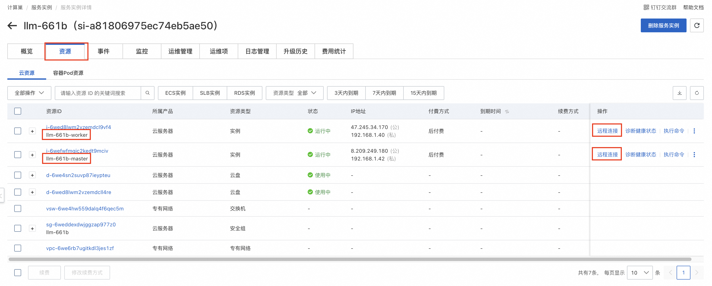

# 基于双ECS实例的DeepSeek-R1和V3模型部署文档

## 部署说明
本服务提供了基于ECS镜像+Vllm+Ray的大模型一键部署方案，30分钟即可通过双ECS实例部署使用DeepSeek-R1满血版和DeepSeek-V3模型。

本服务通过ECS镜像打包标准环境，通过Ros模版实现云资源与大模型的一键部署，开发者无需关心模型部署运行的标准环境与底层云资源编排，仅需添加几个参数即可享受DeepSeek-R1满血版和DeepSeek-V3的推理体验。

本服务提供的方案下，以平均每次请求的token为10kb计算，采用两台H20规格的ECS实例，DeepSeek-R1满血版理论可支持的每秒并发请求数(QPS)约为75，DeepSeek-V3约为67。

本服务支持的模型如下：
* [deepseek-ai/DeepSeek-R1](https://www.modelscope.cn/models/deepseek-ai/DeepSeek-R1)
* [deepseek-ai/DeepSeek-V3](https://www.modelscope.cn/models/deepseek-ai/DeepSeek-V3)

## 整体架构


## 计费说明
本服务在阿里云上的费用主要涉及：
* 所选GPU云服务器的规格
* 节点数量
* 磁盘容量
* 公网带宽
计费方式：按量付费（小时）或包年包月
预估费用在创建实例时可实时看到。


## RAM账号所需权限

部署服务实例，需要对部分阿里云资源进行访问和创建操作。因此您的账号需要包含如下资源的权限。

| 权限策略名称                          | 备注                         |
|---------------------------------|----------------------------|
| AliyunECSFullAccess             | 管理云服务器服务（ECS）的权限           |
| AliyunVPCFullAccess             | 管理专有网络（VPC）的权限             |
| AliyunROSFullAccess             | 管理资源编排服务（ROS）的权限           |
| AliyunComputeNestUserFullAccess | 管理计算巢服务（ComputeNest）的用户侧权限 |

## 部署流程

1. 单击[部署链接](https://computenest.console.aliyun.com/service/instance/create/cn-hangzhou?type=user&ServiceName=LLM推理服务(ECS版))。选择双机版，并确认已申请H20实例规格。根据界面提示填写参数，可根据需求选择是否开启公网，可以看到对应询价明细，确认参数后点击**下一步：确认订单**。
    
    
2. 点击**下一步：确认订单**后可以看到价格预览，随后可点击**立即部署**，等待部署完成。(提示RAM权限不足时需要为子账号添加RAM权限)
    
3. 等待部署完成后，就可以开始使用服务了。点击服务实例名称，进入服务实例详情，使用Api调用示例即可访问服务。如果是内网访问，需保证ECS实例在同一个VPC下。
    
    
    
4. ssh访问ECS实例后，执行 docker logs vllm 即可查询模型服务部署日志。当您看到下图所示结果时，表示模型服务部署成功。模型所在路径为/root/llm_model/。
   

## 使用说明

### 查询模型部署参数

1. 复制服务实例名称。到[资源编排控制台](https://ros.console.aliyun.com/cn-hangzhou/stacks)查看对应的资源栈。
    
    
2. 进入服务实例对应的资源栈，可以看到所开启的全部资源，并查看到模型部署过程中执行的全部脚本。
    
    

### 自定义模型部署参数
如果您有自定义的模型部署参数的需求，可以在部署服务实例后，按照如下操作步骤进行修改。当前提供vllm和sglang两种部署方式。

1. 远程连接，分别登入master节点和worker节点（两台实例分别命名为llm-xxxx-master和llm-xxxx-worker）。
   
2. 执行下面的命令，将两个节点内的模型服务都停止。
    ```shell
    sudo docker stop vllm
    sudo docker rm vllm
3. 请参考本文档中的 查询模型部署参数 部分，获取master节点和worker节点中模型部署实际执行的脚本。
4. 下面分别是vllm与sglang部署的参考脚本，您可参考参数注释自定义模型部署参数，修改实际执行的脚本。修改后，先执行master节点脚本，成功后，再执行worker节点脚本即可。
* vllm部署master节点参考脚本
    ```shell
    docker run -t -d \
    --entrypoint /bin/bash \
    --name=vllm \
    --ipc=host \
    --cap-add=SYS_PTRACE \
    --network=host \
    --gpus all \
    --privileged \
    --ulimit memlock=-1 \
    --ulimit stack=67108864 \
    -v /root:/root \
    egs-registry.cn-hangzhou.cr.aliyuncs.com/egs/vllm:0.7.2-sglang0.4.3.post2-pytorch2.5-cuda12.4-20250224 \
    -c "pip install --upgrade vllm==0.8.2 && # 可自定义版本，如 pip install vllm==0.7.1。必须与worker节点保持一致。
    export NCCL_IB_DISABLE=0 && # 采用弹性RDMA进行高速网络通信所需环境变量，不建议改变
    export NCCL_DEBUG=INFO && # 采用弹性RDMA进行高速网络通信所需环境变量，不建议改变
    export NCCL_NET_GDR_LEVEL=5 && # 采用弹性RDMA进行高速网络通信所需环境变量，不建议改变
    export NCCL_P2P_LEVEL=5 && # 采用弹性RDMA进行高速网络通信所需环境变量，不建议改变
    export NCCL_IB_GID_INDEX=1 && # 采用弹性RDMA进行高速网络通信所需环境变量，不建议改变
    export GLOO_SOCKET_IFNAME=eth0 && # 采用vpc进行网络通信所需环境变量，勿删改
    export NCCL_SOCKET_IFNAME=eth0 && # 采用vpc进行网络通信所需环境变量，勿删改
    ray start --head --dashboard-host 0.0.0.0 --port=6379 && 
    tail -f /dev/null"
* vllm部署worker节点参考脚本
  ```shell
    docker run -t -d \
    --entrypoint /bin/bash \
    --name=vllm \
    --ipc=host \
    --cap-add=SYS_PTRACE \
    --network=host \
    --gpus all \
    --privileged \
    --ulimit memlock=-1 \
    --ulimit stack=67108864 \
    -v /root:/root \
    egs-registry.cn-hangzhou.cr.aliyuncs.com/egs/vllm:0.7.2-sglang0.4.3.post2-pytorch2.5-cuda12.4-20250224 \
    -c "pip install --upgrade vllm==0.8.2 && # 可自定义版本，如 pip install vllm==0.7.1。必须与master节点保持一致。
    export NCCL_IB_DISABLE=0 && # 采用弹性RDMA进行高速网络通信所需环境变量，不建议改变
    export NCCL_DEBUG=INFO && # 采用弹性RDMA进行高速网络通信所需环境变量，不建议改变
    export NCCL_NET_GDR_LEVEL=5 && # 采用弹性RDMA进行高速网络通信所需环境变量，不建议改变
    export NCCL_P2P_LEVEL=5 && # 采用弹性RDMA进行高速网络通信所需环境变量，不建议改变
    export NCCL_IB_GID_INDEX=1 && # 采用弹性RDMA进行高速网络通信所需环境变量，不建议改变
    export GLOO_SOCKET_IFNAME=eth0 && # 采用vpc进行网络通信所需环境变量，勿删改
    export NCCL_SOCKET_IFNAME=eth0 && # 采用vpc进行网络通信所需环境变量，勿删改
    ray start --address='${HEAD_NODE_ADDRESS}:6379' && # 填写master节点的内网IP地址。
    vllm serve /root/llm-model/${ModelName} \ 
    --served-model-name ${ModelName} \
    --gpu-memory-utilization 0.98 \  # Gpu占用率，过高可能导致其他进程触发OOM。取值范围:0~1
    --max-model-len ${MaxModelLen} \ # 模型最大长度，取值范围与模型本身有关。
    --enable-chunked-prefill \
    --host=0.0.0.0 \
    --port 8080 \
    --trust-remote-code \
    --api-key "${VLLM_API_KEY}" \
    --tensor-parallel-size $(nvidia-smi --query-gpu=index --format=csv,noheader | wc -l | awk '{print $1}') \ # 单节点使用GPU数量，默认使用单台ECS实例的全部GPU。
    --pipeline-parallel-size 2" # 流线并行数，推荐设置为节点总数。
* sglang部署master节点参考脚本
  ```shell
   docker run -d -t --net=host --gpus all \
   --entrypoint /bin/bash \
   --privileged \
   --ipc=host \
   --name llm-server \
   -v /root:/root \
   egs-registry.cn-hangzhou.cr.aliyuncs.com/egs/vllm:0.7.2-sglang0.4.3.post2-pytorch2.5-cuda12.4-20250224 \ 
   -c "pip install sglang==0.4.3 && # 可自定义版本，必须与worker节点保持一致
    export NCCL_IB_DISABLE=0 && # 采用弹性RDMA进行高速网络通信所需环境变量，不建议改变
    export NCCL_DEBUG=INFO && # 采用弹性RDMA进行高速网络通信所需环境变量，不建议改变
    export NCCL_NET_GDR_LEVEL=5 && # 采用弹性RDMA进行高速网络通信所需环境变量，不建议改变
    export NCCL_P2P_LEVEL=5 && # 采用弹性RDMA进行高速网络通信所需环境变量，不建议改变
    export NCCL_IB_GID_INDEX=1 && # 采用弹性RDMA进行高速网络通信所需环境变量，不建议改变
    export GLOO_SOCKET_IFNAME=eth0 && # 采用vpc进行网络通信所需环境变量，勿删改
    export NCCL_SOCKET_IFNAME=eth0 && # 采用vpc进行网络通信所需环境变量，勿删改
   python3 -m sglang.launch_server \
   --model-path /root/llm-model/${ModelName} \
   --served-model-name ${ModelName} \
   --tp 16 \ # 当前sglang不支持流线并行，默认使用两台ECS实例中全部GPU。
   --dist-init-addr ${HEAD_NODE_ADDRESS}:20000 # 填写master节点的内网IP地址。
   --nnodes 2 # 节点总算，默认使用两台ECS实例。
   --node-rank 0 # 节点序号，默认为0。
   --trust-remote-code \
   --host 0.0.0.0 \
   --port 8080 \
   --mem-fraction-static 0.9 # Gpu占用率，过高可能导致其他进程触发OOM。取值范围:0~1
* sglang部署worker节点参考脚本
  ```shell
   docker run -d -t --net=host --gpus all \
   --entrypoint /bin/bash \
   --privileged \
   --ipc=host \
   --name llm-server \
   -v /root:/root \
   egs-registry.cn-hangzhou.cr.aliyuncs.com/egs/vllm:0.7.2-sglang0.4.3.post2-pytorch2.5-cuda12.4-20250224 \ 
   -c "pip install sglang==0.4.3 && # 可自定义版本，必须与master节点保持一致
    export NCCL_IB_DISABLE=0 && # 采用弹性RDMA进行高速网络通信所需环境变量，不建议改变
    export NCCL_DEBUG=INFO && # 采用弹性RDMA进行高速网络通信所需环境变量，不建议改变
    export NCCL_NET_GDR_LEVEL=5 && # 采用弹性RDMA进行高速网络通信所需环境变量，不建议改变
    export NCCL_P2P_LEVEL=5 && # 采用弹性RDMA进行高速网络通信所需环境变量，不建议改变
    export NCCL_IB_GID_INDEX=1 && # 采用弹性RDMA进行高速网络通信所需环境变量，不建议改变
    export GLOO_SOCKET_IFNAME=eth0 && # 采用vpc进行网络通信所需环境变量，勿删改
    export NCCL_SOCKET_IFNAME=eth0 && # 采用vpc进行网络通信所需环境变量，勿删改
   python3 -m sglang.launch_server \
   --model-path /root/llm-model/${ModelName} \
   --served-model-name ${ModelName} \
   --tp 16 \ # 当前sglang不支持流线并行，默认使用两台ECS实例中全部GPU。
   --dist-init-addr ${HEAD_NODE_ADDRESS}:20000 # 填写master节点的内网IP地址。
   --nnodes 2 # 节点总算，默认使用两台ECS实例。
   --node-rank 1 # 节点序号，默认为1。
   --trust-remote-code \
   --host 0.0.0.0 \
   --port 8080 \
   --mem-fraction-static 0.9 # Gpu占用率，过高可能导致其他进程触发OOM。取值范围:0~1


### 内网API访问
复制Api调用示例，在资源标签页的ECS实例中粘贴Api调用示例即可。也可在同一VPC内的其他ECS中访问。
    
    
    
### 公网API访问
复制Api调用示例，在本地终端中粘贴Api调用示例即可。
    
    

## 使用 Chatbox 客户端配置 vLLM API 进行对话(可选)

1. 访问 Chatbox [下载地址](https://chatboxai.app/zh#download)下载并安装客户端，本方案以 macOS M3 为例。
   
2. 运行并配置 vLLM API ，单击设置。
   
3. 在弹出的看板中按照如下表格进行配置。

| 项目                              | 说明                         |示例值 |
|---------------------------------|----------------------------|----------------------------|
| 模型提供方            | 下拉选择模型提供方。          | 添加自定义提供方 |
| 名称             | 填写定义模型提供方名称。             | vLLM API |
| API 域名            | 填写模型服务调用地址。           | http://<ECS公网IP>:8000 |
| API 路径 | 填写 API 路径。 | /v1/chat/completions |
| 网络兼容性             | 点击开启改善网络兼容性             | 开启 |
| API 密钥            | 填写模型服务调用 API 密钥。           | 部署服务实例后，在服务实例页面可获取Api_Key
| 模型 | 填写调用的模型。 | deepseek-ai/DeepSeek-R1 |

4. 保存配置。在文本输入框中可以进行对话交互。输入问题你是谁？或者其他指令后，调用模型服务获得相应的响应。
   

## 性能测试
本服务方案下，针对Deepseek-R1和V3，分别测试QPS为75和60情况下模型服务的推理响应性能，压测持续时间均为20s。

### Deepseek-R1
#### QPS为75


### Deepseek-V3
#### QPS为60


### 压测过程(供参考)
>**前提条件：** 1. 无法直接测试带api-key的模型服务；2. 需要公网。
#### 重新部署模型服务
1. 远程连接，登入worker节点（命名为llm-xxxx-worker）。
   
2. 执行下面的命令，将模型服务停止。
    ```shell
    sudo docker stop vllm
    sudo docker rm vllm
3. 请参考本文档中的 查询模型部署参数 部分，获取worker节点模型部署实际执行的脚本。
4. 去掉脚本中的--api-key参数，在ECS实例中执行剩余脚本。执行docker logs vllm。若结果如下图所示，则模型服务重新部署成功。
    
#### 进行性能测试
以Deepseek-R1为例，模型服务部署完成后，ssh登录ECS实例。执行下面的命令，即可得到模型服务性能测试结果。可根据参数说明自行修改。
   ```shell
    yum install -y git-lfs
    git lfs install
    git lfs clone https://www.modelscope.cn/datasets/gliang1001/ShareGPT_V3_unfiltered_cleaned_split.git
    git lfs clone https://github.com/vllm-project/vllm.git
    
    docker exec vllm bash -c "
    pip install pandas datasets &&
    python3 /root/vllm/benchmarks/benchmark_serving.py \
    --backend vllm \
    --model /root/llm-model/deepseek-ai/DeepSeek-R1 \
    --served-model-name deepseek-ai/DeepSeek-R1 \
    --sonnet-input-len 1024 \ # 最大输入长度
    --sonnet-output-len 4096 \ # 最大输出长度
    --sonnet-prefix-len 50 \ # 前缀长度
    --num-prompts 400 \ # 从数据集中随机选取或按顺序处理 400 个 prompt 进行性能测试。
    --request-rate 20 \ # 模拟每秒 20 个并发请求的压力测试，持续20秒，共400个请求。评估模型服务在负载下的吞吐量和延迟。
    --port 8080 \
    --trust-remote-code \
    --dataset-name sharegpt \
    --save-result \
    --dataset-path /root/ShareGPT_V3_unfiltered_cleaned_split/ShareGPT_V3_unfiltered_cleaned_split.json
    "